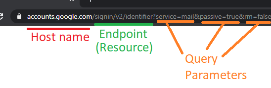
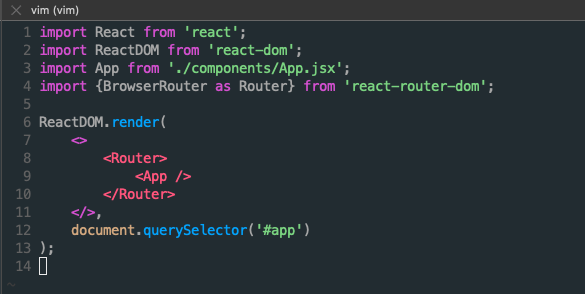
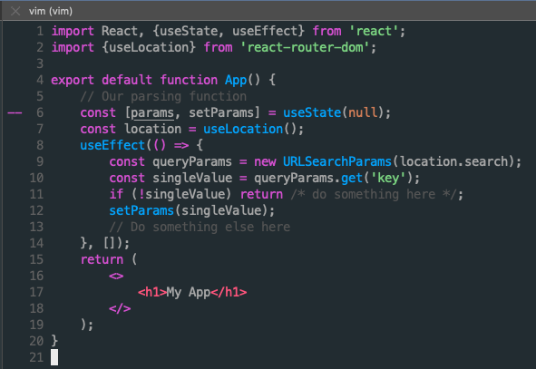

# Getting Started

> Each section should be completed in order from top to bottom because some of the skills build on each other.
# Learn Git
- ### What Is GitHub?
At a high level, GitHub is a website and cloud-based service that helps developers store and manage their code, as well as track and control changes to their code. To understand exactly what GitHub is, you need to know two connected principles:

-Version control
-Git

- ### Install Git ([LINK](https://git-scm.com/downloads))

- ### Create a Local Git Repository
     To create a Git repository, follow the steps below:

1. Open a Git Bash terminal and move to the directory where you want to keep the project on your local machine. For example:

       cd ~/Desktop
       mkdir myproject
       cd myproject/
 
    In this example, we changed the directory to Desktop and created a subdirectory called myproject
  
2. Create a Git repository in the selected folder by running the git init command. The syntax is:

       git init [repository-name]
    
    

    Now you have successfully created a local Git repository.

- ### Create a New Repository on GitHub
    GitHub allows you to keep track of your code when you're working with a team and need to modify the project's code collaboratively.

    Follow these steps to create a new repository on GitHub:

    1. Log in and browse to the GitHub home page.

    2. Find the <strong> New repository </strong> option under the <strong>+</strong> sign next to your profile picture, in the top right corner.
       
    
      
    3. Enter a name for your repository, provide a brief description, and choose a privacy setting.
      
    
      
    4. Click the Create repository button.

     GitHub allows you to add an existing repo you have <strong>created locally.</strong> To push a local repository from your machine to GitHub, use the following syntax:
     
       git remote add origin https://github.com/[your-username]/[repository-name.git]
       git push -u origin master
    
    For example:
      
    
      
    
- ### Add a File to the Repository
    Git notices when you add or modify files in the folder containing the Git repository but doesn't track the file unless instructed. Git saves the changes only for the files it tracks, so you need to let Git know you want to track changes for a specific file.
    
    You can check which files Git is tracking by running:
    
      git status
      
    
      
    Git notifies you if you have any untracked files. If you want Git to start tracking a file, run the following command:
    
      git add [filename]
      
    For example:
    
   
      
    
    In this example, we instructed Git to start tracking changes for the test.txt file. Rerunning the <strong>git status</strong> command shows that Git is tracking the specified file.
    

- ### Unstage Files on Git
    Working with Git usually involves adding all the files to your index to prepare them for a commit. If you want to remove some files from the index before committing, you have to unstage the files in Git.

One way to unstage files on Git is to run the <strong>git reset</strong> command. The syntax is:

      git reset [commit] -- [file_path]
    
    For example:
    

      

- ### Create a Commit
     After adding the specified files to the staging environment, instruct Git to package the files into a commit using the git commit command. Git then stores that file version. You can review the stored version at any given time.

The syntax is:

      git commit -m "Notes about the commit"
      
   Add a message at the end of the commit to state whether it's a new feature, a bug fix, or anything else. Commits remain in the repository, and they are rarely deleted, so an explanation of what you changed helps other developers working on the project or help you keep track of all the changes.

For example:

      

- ### Undo Last Commit
     Use the revert and reset commands to undo changes and revert to a previous commit.

To undo a published commit, use the following syntax:

      git revert [hash]
    
A hash is a code that identifies each commit. Obtain a commit hash by running:

      git log
    
For example:

      

In this example, we first ran the <strong>git log</strong> command to obtain the commit hash and then reverted the last commit by running <strong>git revert</strong> with the commit hash we obtained.

- ### Create a New Branch
The first branch in a git repository is called master, and it is the primary branch in a project.

Creating a new Git branch means creating a copy of the project from a specific point in time. Branches in Git allow users to make new features without applying the changes to the main branch while the feature is in development.

The common method for creating a new branch is by running:

      git branch [new_branch_name]

For example:

      

In this example, we create a new branch named new-feature.

- ### Switch Branches
Having several branches of a Git project provides a test environment for developers to track progress without affecting the production version of an application. Git allows you to switch between branches with the <strong>checkout</strong> command easily. The syntax is:

      git checkout [branch_name]

Replace [branch_name] with the branch name you want to access.

For example:

  
    
- ### Rename a Local or Remote Git Branch
In Git, you can rename a local or remote Git branch.

The syntax for changing a local Git branch name is:

      git branch -m new-name

For example:

In this example, we changed the local branch name from new-feature to feature-testing.

Since there isn’t a way to directly rename a remote Git branch, you first need to delete the old branch name, then push the new branch name to the remote repository.

- ### Delete a Local or Remote Git Branch
You may decide to delete a Git branch after merging the changes with the master branch or if the branches become corrupted.

You can delete local and remote Git branches.

Deleting a local branch doesn't affect a remote branch. To delete a <strong>local</strong> Git branch, run:

      git branch -d [branch_name]
      
   Use the following syntax to delete a remote Git branch:
   
      git push [remote_project] --delete [branch_name]
      
   In this example, we deleted a local Git branch:
   
   
   
- ### Set Upstream Branch
Sending something upstream in Git means that you are sending it back to the repository owner.

Using the <strong>git set upstream</strong> command, you can choose the flow direction of your current local branch. The command also allows you to change the default remote branch.

   

Our tutorial on What Is Git Upstream and How to Set an Upstream Branch deals with the different methods for setting an upstream branch and gives a detailed explanation on the topic.

- ### Remove a Git Remote
A git remote is a connection to a repository hosted on a <strong>remote server</strong> – GitHub, BitBucket, GitLab, or any other remote location.

However, over time, the remote repository may move to another host, or a team member may stop working on the project. The remote in question is then no longer needed.

There are several ways to remove a Git remote. One of the ways is to delete a remote using the command line. The syntax is:

      git remote remove [remote name]
      
In the following example, running <strong>git remote -v</strong> shows the available remotes, 'origin' and 'test-remote.' After removing 'test-remote' and rerunning <strong>git remote -v</strong> to list available remotes, we see that the only available remote is 'origin.'

   

- ### Git Merge
 
Git merge unifies <strong>multiple commit sequences into a single commit.</strong> It can combine two branches, thus integrating the independent development lines into a single branch.

After merging two branches, Git updates the current branch to reflect the merge, but the target branch isn't affected. That means you have to use the <strong>git branch -d</strong> command to delete the obsolete target branch.

For example, you may want to merge a new feature branch into the main branch. Follow the steps below:

1. Run the <strong>git status</strong> command to ensure that HEAD is pointing to the correct merge-receiving (master) branch. If it is not, run <strong>git checkout </strong>master to switch to the master branch.

   
   
2. Run git fetch to pull the latest remote commits and git pull to ensure the main branch has the latest updates.

   
   
3. Run git merge X where X is the name of the branch you want to merge into the receiving branch.

   

- ### Resolve Merge Conflicts
 Merge conflicts usually occur when multiple developers work on the same code of a project or when they work with several development branches. Git merge warns the user about these conflicts.

Although most merge conflicts resolve automatically, there are cases when git merge cannot resolve an issue.

- ### Create a Pull Request
 Create a pull request (PR) to inform a repository owner that they should review the changes you've made to their code. Then the owner can approve the pull request and merge the changes into the main repository.
 
 If you are the co-owner or owner of a repository, you don't have to create pull requests to merge your changes. However, you can still do it to keep track of your feature updates and history.

For this guide, we will create a readme file for our repository locally and make a pull request on GitHub to illustrate the process.

Follow the steps below:

1. In Git Bash, create an empty readme file by running <strong>touch readme.md.</strong>

2. Create and switch to a new branch on which to modify the file. Run:

      git checkout -b create-readme-file

3. Open the readme file in a text editor and add the text you want it to contain. In this example, we will use the Nano text editor to modify the file within the command line window. Run <strong>nano readme.md<s/trong>.

   

 4. After you save the file, track it by running <strong>git add readme.md<strong>.

5. Create a commit.

      git commit -m "Added a readme file"

6. Push the changes to GitHub.
     
      git push origin create-readme-file
     
 7. Log in to your GitHub page. There is now a <strong>Create pull request</strong> option in your repository with the branch name we created in the command line. Click the <strong>Compare & pull request</strong> button.
   
   
  
8. GitHub states if you can merge the branches and apply the changes. Optionally, add a comment about your pull request and click <strong>Create pull request<strong>. 
     
   
     
   Now the repository owner, in this case, you, can review the changes and accept or reject them.

You can accept the changes in the <strong>Pull requests</strong> tab on GitHub. When you merge the branches, delete the obsolete branch by clicking <strong>Delete branch</strong> to keep the repository clean.
   
- ### Synchronize Changes on GitHub and Locally
  When you merge changes on GitHub, they don't appear automatically in your local repository. You have to pull the changes to your local repository to see the updates.

Synchronize your local repository with GitHub by running:
     
      git pull origin master
     
The command updates your local repository to match the one on GitHub, and states the changes.

In the following example, we first switched to our master branch, and Git warned us that we should update our local repository:     
   
   
   
 ---
 
# JavaScript
- ### What is javascript?
     JavaScript is a scripting or programming language that allows you to implement complex features on web pages — every time a web page does more than just sit there and display static information for you to look at — displaying timely content updates, interactive maps, animated 2D/3D graphics, scrolling video jukeboxes, etc. — you can bet that JavaScript is probably involved. It is the third layer of the layer cake of standard web technologies, two of which (HTML and CSS) we have covered in much more detail in other parts of the Learning.
     
     <strong>Html</strong> is the markup language that we use to structure and give meaning to our web content, for example defining paragraphs, headings, and data tables, or embedding images and videos in the page.
     
     <strong>CSS</strong> is a language of style rules that we use to apply styling to our HTML content, for example setting background colors and fonts, and laying out our content in multiple columns.
     
     <strong>Javascript</strong> is a scripting language that enables you to create dynamically updating content, control multimedia, animate images, and pretty much everything else. (Okay, not everything, but it is amazing what you can achieve with a few lines of JavaScript code.)

    
   
    Let's look at some more specific uses of JavaScript in web development
     
     - <strong>Front-End Interactivity:</strong> Web development is only made better by the increased interactivity and features that JavaScript offers.
     - <strong>Web Applications:</strong> Web applications are similar to websites, but instead, they get packaged into a neat little box, which improves control over security and more.
     - <strong>Browser Games:</strong> The modern web browser has come a long way; developers even make robust games that function in a browser.
     - <strong>Back End Web Development:</strong> Web development has come a long way, and now JavaScript is so robust it can even be used to manage the back end of websites and web applications

    Here’s an illustration of all the possible use cases of JS today:
 
    
     
- ### How does JavaScript work?   
     JavaScript is considered a client-side scripting language, which means that it operates on the user's browser and does not function on an external device. An example of a language that is not client-side would be MySQL, a server-side language that handles any database requests.
     
     JavaScript also does not require that anything be downloaded to the user's devices, as modern browsers have the required software integrated into them. This makes JavaScript much more user-friendly than some other languages can be.

  Execution of js –
     1. in browser ( open browser and inspect or console) 
     2. js can be run outside of browser using nodejs
     3. use < script> tag inside any html doc and run that html file

- ### Variables  –      
     
     There are some rules while declaring a JavaScript variable (also known as identifiers).
     1.Name must start with a letter (a to z or A to Z), underscore( _ ), or dollar( $ ) sign.
     2.After first letter we can use digits (0 to 9), for example value1.
     3.JavaScript variables are case sensitive, for example x and X are different variables.

- ### Local variable - 
     A JavaScript local variable is declared inside block or function. It is accessible within the function or block only. 
    
     For example:
     
        

- ### Global variable -      
     A JavaScript global variable is accessible from any function. A variable i.e. declared outside the function or declared with window object is known as global variable. 
     For example:
           
        

- ### VAR     
     Before the advent of ES6, var declarations ruled. There are issues associated with variables declared with var , though. That is why it was necessary for new ways to declare variables to emerge i.e. <strong>let</strong> and <strong>const.</strong>
     
- ### Let
     let is now preferred for variable declaration. It's no surprise as it comes as an improvement to var declarations. It also solves the problem with var that we can’t redeclare  a variable so that to resolve the overriding of variable value if not done knowingly.

     However, if the same variable is defined in different scopes, there will be no error:

      let greeting = "say Hi";
      if (true) {
      let greeting = "say Hello instead";
      console.log(greeting); // "say Hello instead"
      }
      console.log(greeting);//”Say hi”
     
- ### Const     
     Variables declared with the const maintain constant values. const declarations share some similarities with let declarations.   

      const greeting = "say Hi";
      greeting = "say Hello instead";// error: Assignment to constant variable. 

      nor this:
      
      const greeting = "say Hi";
      const greeting = "say Hello instead";// error: Identifier 'greeting' has already been declared

    
     
- ### Data Types     
     There are eight basic data types in JavaScript. They are:
     
     | Data Types | Description | Example |
     |-----:|---------------|---------------|
     |1.String| represents textual data|'hello', "hello world!" etc|
     |2.Number|an integer or a floating-point number|3, 3.234, 3e-2 etc.|
     |3.Big Int|an integer with arbitrary precision|900719925124740999n , 1n etc.|
     |4.Boolean|Any of two values: true or false|true and false|
     |5.Undefined|a data type whose variable is not initialized|let a;|
     |6.Null|denotes a null value|let a = null;|
     |7.Symbol |data type whose instances are unique and immutable|let value = Symbol('hello');|
     |8.Object|key-value pairs of collection of data|let student = { };|
     
     Here, all data types except Object are primitive data types, whereas Object is non-primitive.
     
     > Note: The Object data type (non-primitive type) can store collections of data, whereas primitive data type can only store a single data.     
     
- ### Template literals (Template strings)     
     Template literals are literals delimited with backtick (`) characters, allowing for multi line strings, string interpolation  with embedded expressions.
     
     Template literals are sometimes informally called template strings, because they are used most commonly , string interpolation  (to create strings by doing substitution of placeholders).
     
 - ### Syntax    
 
      `string text`

      `string text line 1`
      
      `string text line 2`
      
      `let expression = 2;`
      
      `string text ${expression} string text`
     
- ### Operators
     JavaScript operators are symbols that are used to perform operations on operands.
     For example:

     `1.	var sum=10+20;`

     Here, + is the arithmetic operator and = is the assignment operator.
     
     There are following types of operators in JavaScript.

    

- ### Arithmetic Operators     
     |Operator|Description|Example|
     |-----:|---------------|---------------|
     |  +  |Addition|10+20 = 30|
     |  -  |Subtraction|20-10 = 10|
     |  *  |Multiplication|10*20 = 200|
     |  /  |Division|20/10 = 2|
     |  %  |Modulus (Remainder)|20%10 = 0|
     |  ++  |Increment|var a=10; a++; Now a = 11|
     |  --  |Decrement|var a=10; a--; Now a = 9|

 - ### Comparison Operators    
     
     |Operator|Description|Example|
     |-----:|---------------|---------------|
     |  ==  |Is equal to|10==20 = false|
     |  ===  |Identical (equal and of same type)|10==20 = false|
     |  !=  |Not equal to|10!=20 = true|
     |  !==  |Not Identical|20!==20 = false|
     |  >  |Greater than|20>10 = true|
     |  >=  |Greater than or equal to|20>=10 = true|
     |  < |Less than|20<10 = false|
     |  <= |Less than or equal to|20<=10 = false|

- ### Bitwise Operators

     |Operator|Description|Example|
     |-----:|---------------|---------------|
     |  &  |Bitwise AND|(10==20 & 20==33) = false|
     |  |  |Bitwise OR|(10==20 | 20==33) = false|
     |  ^  |Bitwise XOR|(10==20 ^ 20==33) = false|
     |  ~  |Bitwise NOT|(~10) = -10|
     |  << |Bitwise Left Shift|(10<<2) = 40|
     |  >> |Bitwise Right Shift|(10>>2) = 2|
     |  >>> |Bitwise Right Shift with Zero|(10>>>2) = 2|
    
- ### Logical Operators

     |Operator|Description|Example|
     |-----:|---------------|---------------|
     |  &&  |Logical AND|(10==20 && 20==33) = false|
     |  ||  |Logical OR|(10==20 || 20==33) = false|
     |  !  |Logical Not|!(10==20) = true|

- ### Assignment Operators

     |Operator|Description|Example|
     |-----:|---------------|---------------|
     |  =  |Assign|10+10 = 20|
     |  +=  |Add and assign|var a=10; a+=20; Now a = 30|
     |  -=  |Subtract and assign|var a=20; a-=10; Now a = 10|
     |  *=  |Multiply and assign|var a=10; a*=20; Now a = 200|
     |  /=  |Divide and assign|var a=10; a/=2; Now a = 5|
     |  %=  |Modulus and assign|var a=10; a%=2; Now a = 0|
   
- ### Special Operators

     |Operator|Description|
     |-----:|---------------|
     |(?:)|Conditional Operator returns value based on the condition. It is like if-else.|
     |  ,  |Comma Operator allows multiple expressions to be evaluated as single statement.|
     |  delete  |Delete Operator deletes a property from the object.|
     |  In  |In Operator checks if object has the given property|
     |  Instanceof  |checks if the object is an instance of given type|
     |  New  |creates an instance (object)|
     |  Typeof  |checks the type of object.|
     |  Void  |it discards the expression's return value.|
     |  Yield  |checks what is returned in a generator by the generator's iterator.|

- ### String
     The <strong>JavaScript string</strong> is an object that represents a sequence of characters.
     |Methods|Description|
     |-----:|---------------|
     |charAt()| It provides the char value present at the specified index.|
     |charCodeAt()|It provides the Unicode value of a character present at the specified index.|
     |concat()|It provides a combination of two or more strings.|
     |indexOf()|It provides the position of a char value present in the given string.|
     |lastIndexOf()|It provides the position of a char value present in the given string by searching a character from the last position.|
     |search()|It searches a specified regular expression in a given string and returns its position if a match occurs.|
     |match()|It searches a specified regular expression in a given string and returns that regular expression if a match occurs.|
     |replace()|It replaces a given string with the specified replacement.|
     |substr()|It is used to fetch the part of the given string on the basis of the specified starting position and length.|
     |substring()|It is used to fetch the part of the given string on the basis of the specified index.|
     |slice()|It is used to fetch the part of the given string. It allows us to assign positive as well negative index.|
     |toLowerCase()|It converts the given string into lowercase letter.|
     |toLocaleLowerCase()|It converts the given string into lowercase letter on the basis of host?s current locale.|
     |toUpperCase()|It converts the given string into uppercase letter.|
     |toLocaleUpperCase()|It converts the given string into uppercase letter on the basis of host?s current locale.|
     |toString()|It provides a string representing the particular object.|
     |valueOf()|It provides the primitive value of string object.|
     |split()|It splits a string into substring array, then returns that newly created array.|
     |trim()|It trims the white space from the left and right side of the string.|

- ### Conditional Statements

     - if Statement
     
      if (condition) {
      //  block of code to be executed if the condition is true
      }

     - if else Statement
     
      if (condition) {
      //  block of code to be executed if the condition is true
      } else {
      //  block of code to be executed if the condition is false
      }

     - else if Statement 
    
      if (condition1) {
      //  block of code to be executed if condition1 is true
      } else if (condition2) {
      //  block of code to be executed if the condition1 is false and condition2 is true
      } else {
      //  block of code to be executed if the condition1 is false and condition2 is false
      }

     - Switch Statement
     
      switch(expression) {
      case x:
      // code block
      break;
      case y:
      // code block
      break;
      default:
      // code block
      }

- ### Loops
     The JavaScript loops are used to iterate the piece of code using for, while, do while or for-in loops. It makes the code compact. It is mostly used in array.
     
     There are four types of loops in JavaScript.
     1.for loop
     2.while loop
     3.do-while loop
     4.for-in loop

    - For loop
     The  `for loop` iterates the elements for the fixed number of times. It should be used if number of iteration is known. The syntax of for loop is given below.
     
     |    |    |
     |-----:|---------------|
     |for (initialization; condition; increment) { code to be executed }||

    - while loop
    
    `while loop` iterates the elements for the infinite number of times. It should be used if number of iteration is not known. The syntax of while loop is given below.
    
     |    |    |
     |-----:|---------------|
     |while (condition) { code to be executed }||

     - do while loop

     `do while loop` iterates the elements for the infinite number of times like while loop. But, code is executed at least once whether condition is true or false. The syntax of do while loop is given below.

      do
      {  
      code to be executed  
      } while (condition);  
-

        

     - for...in loop
     In each iteration of the loop, a key is assigned to the key variable. The loop continues for all object properties.
     
      for (key in object) {
      // body of for...in
      }
-

      const student = {
      name: 'Monica',
      class: 7,
      age: 12
      }
      // using for...in
      for ( let key in student ) {
      // display the properties
      console.log(`${key} => ${student[key]}`);
      }

- ### Functions
     `Functions` are used to perform operations. We can call JavaScript function many times to reuse the code.

     - With Arguments
     
        
      <form>  
      <input type="button" value="click" onclick="getcube(4)"/>  
      </form> 

     - Return value
     
       

     - Function Object

        

- ### Let's see function methods with description.

     |Method|Description|
     |-----:|---------------|
     |apply()|It is used to call a function contains this value and a single array of arguments.|
     |bind()|It is used to create a new function.|
     |call()|It is used to call a function contains this value and an argument list.|
     |toString()|It returns the result in a form of a string.|

- ### Arrow Functions
     - Arrow functions were introduced in ES6.
     
     Syntax before arrow
     
      hello = function() {
      return "Hello World!";
      }

     Syntax after arrow

      hello = () => {
      return "Hello World!";
      }

- ### Objects
     A javaScript object is an entity having state and behavior (properties and method). For example: car, pen, bike, chair, glass, keyboard, monitor etc
     
     JavaScript is an object-based language. Everything is an object in JavaScript.
JavaScript is template based not class based. Here, we don't create class to get the object. But, we direct create objects

     There are 3 ways to create objects.

     - JavaScript Object by object literal

     Syntax
     
__

      object={
      property1:value1,
      property2:value2
      }  
__

        

__

     - By creating instance of Object
__

     Syntax
     
      var objectname=new Object();  
__

        
__

     - By using an Object constructor
__

        

- ### Arrays
     An array is a special variable, which can hold more than one value.

     - Why to use Arrays
     If you have a list of items (a list of car names, for example), storing the cars in single variables could look like this:

      let car1 = "Saab";
      let car2 = "Volvo";
      let car3 = "BMW";

     However, what if you want to loop through the cars and find a specific one? And what if you had not 3 cars, but 300?
     
     The solution is an array!
     
     An array can hold many values under a single name, and you can access the values by referring to an index number.

     - Creating an Array

      const array_name = [item1, item2, ...]; 
__

      const cars= ["Saab", "Volvo", "BMW"];
      Spaces and line breaks are not important. A declaration can span multiple lines:
      const cars = ["Saab","Volvo","BMW"];

- ### Arrays are Objects
     Arrays are a special type of objects. The typeof operator in JavaScript returns "object" for arrays.
     
     But, JavaScript arrays are best described as arrays.
     
     Arrays use numbers to access its "elements". In this example, person[0] returns John:
     
     Array : `const person = ["John", "Doe", 46];`
     
     Objects use names to access its "members". In this example, person.firstName returns John:
     
     Objects : `const person = {firstName:"John", lastName:"Doe", age:46};`

- ### Promises
     The Promise object represents the eventual completion (or failure) of an asynchronous operation and its resulting value.
     A Promise is in one of these states:
     - pending: initial state, neither fulfilled nor rejected.
     - fulfilled: meaning that the operation was completed successfully.
     - rejected: meaning that the operation failed.

   

     - A promise can be created using Promise constructor

     Syntax : 

      var promisename = new Promise (function(resolve,reject){
      //do something
      })
      
     Example :
     
      var promise = new Promise(function(resolve, reject) {
      const x = "geeksforgeeks";
      const y = "geeksforgeeks"
      if(x === y) {
      resolve();
      } else {
      reject();
      }
      });
   
      promise.
      then(function () {
      console.log('Success, You are a GEEK');
      }).
      catch(function () {
      console.log('Some error has occurred');
      });

     - When a promise is fulfilled
     When a promise is fulfilled, you can access the resolved data in the then method of the promise:

      promise.then(value => {
      // use value for something
      })

     Think of the then method as "this works and then do this with the data returned from the promise". If there is no data, you can skip the then method.
     It's also possible that the then method can return another promise, so you can chain another then method like this:

      Promise
      .then(value => {
      return value.anotherPromise()
      })
      .then(anotherValue => {
      // use this value
      })

     - When a promise is rejected
     When a promise is rejected (that is, the promise fails), you can access the error information returned in the catch method of the promise:

      promise.catch(error => {
      // interpret error and maybe display something on the UI
      })

     - When a promise settles
     There's a last stage of the promise. Whether the promise is fulfilled or is rejected, the promise has been completed (has been settled). At this completed stage, you can finally do something.
     
     example
     
      let dataIsLoading = true;

      promise
      .then(data => {
      // do something with data
      })
      .catch(error => {
      // do something with error
      })
      .finally(() => {
      dataIsLoading = false;
      })

- ### Async Syntax
     The keyword async before a function makes the function return a promise:

      async function myFunction() {
      return "Hello";
      }
      is same as :
      function myFunction() {
      return Promise.resolve("Hello");
      }

- ### Await Syntax

     The await keyword can only be used inside an async function.

      async function myDisplay(){
      let myPromise= new Promise(function(resolve,reject){
      resolve("resolved!");
      });
      document.getElementById("demo").innerHTML = await myPromise;
      }

      myDisplay();

     The two arguments (resolve and reject) are pre-defined by JavaScript.
     We will not create them, but call one of them when the executor function is ready.

- ### Browser Object Model (BOM)

     The Browser Object Model (BOM) is used to interact with the browser.

     example

      window.alert("hello javatpoint");  

      is same as: 

      alert("hello javatpoint");  

- ### Document Object Model
     The document object represents the whole html document.
     When html document is loaded in the browser, it becomes a document object. It is the root element that represents the html document. It has properties and methods. 

      window.document  
      is same as :
      document  

- ### The important methods of document object are as follows:

     |Method|Description|
     |-----:|---------------|
     |write("string")|writes the given string on the doucment.|
     |writeln("string")|writes the given string on the doucment with newline character at the end.|
     |getElementById()|returns the element having the given id value.|
     |getElementsByName()|returns all the elements having the given name value.|
     |getElementsByTagName()|returns all the elements having the given tag name.|
     |getElementsByClassName()|returns all the elements having the given class name.|

- ### Classes
     ECMAScript 2015, also known as ES6, introduced JavaScript Classes.
     JavaScript Classes are templates for JavaScript Objects.

     - Use the keyword class to create a class.
     - Always add a method named `constructor():`
     
      class ClassName{
      constructor(){ 
      ... }
      }

     - The example below creates a class named "Car".
     - The class has two initial properties: "name" and "year".

      class Car{
      constructor(name, year) {
      this.name =name;
      this.year =year;
      }
      }

     A JavaScript class is not an object.
     It is a template for JavaScript objects.

     When you have a class, you can use the class to create objects:

      let myCar1= new Car("Ford", 2014);
      let myCar2 = new Car("Audi", 2019);
      The example above uses the Car class to create two Car objects.
      The constructor method is called automatically when a new object is created.

   

- ### Exception Handling 
     In programming, exception handling is a process or method used for handling the abnormal statements in the code and executing them. It also enables to handle the flow control of the code/program. 

     `try{} statement`: Here, the code which needs possible error testing is kept within the try block. In case any error occur, it passes to the catch{} block for taking suitable actions and handle the error. Otherwise, it executes the code written within.

     `catch{} statement`: This block handles the error of the code by executing the set of statements written within the block. This block contains either the user-defined exception handler or the built-in handler. This block executes only when any error-prone code needs to be handled in the try block. Otherwise, the catch block is skipped

      try{  
      expression; //code to be written.  
      } catch(error){  
      expression;
      } // code for handling the error.  

__

      try{  
      var a= ["34","32","5","31","24","44","67"]; //a is an array  
      document.write(a);    // displays elements of a  
      document.write(b); //b is undefined but still trying to fetch its value. Thus catch block       will be invoked  
      }catch(e)
      {  
      alert("There is error which shows "+e.message); //Handling error  
      }  

__   
           
Throw statements are used for throwing user-defined errors. User can define and throw their own custom errors.
-
           throw exception;  
__

      try {  
      throw new Error('This is the throw keyword'); //user-defined throw statement.  
      }  catch (e) {  
      document.write(e.message); // This will generate an error message  
      }  

- ### try…catch…finally statements
     Finally is an optional block of statements which is executed after the execution of try and catch statements.

      try{  
      expression;  
      }  catch(error){  
      expression;  
      }  finally{  
      expression;
      } //Executable code  

__

      try{  
      var a=2;  
      if(a==2)  
      document.write("ok");  
      }  catch(Error){  
      document.write("Error found"+e.message);  
      }  finally{  
      document.write("Value of a is 2 ");  
      } 

- ### Use Strict (Strict Mode )
`"use strict"`; Defines that JavaScript code should be executed in "strict mode".

Strict mode is declared by adding `"use strict"`; to the beginning of a script or a function.

      “use strict”;
      myFunction();

      function myFunction() {
      y = 3.14;   // This will also cause an error because y is not declared
      }

__

      x = 3.14;       //  This will not causeerror.
      myFunction();

      function myFunction() {
      “use strict”;
      y = 3.14;   // This will cause an error
      }
     
 ---
 
 # HTML
- ### What Is HTML ?
  - HTML stands for hyper text markup language .
  - HTML is the code that is used to structure a web page and its content.
  - The component used to design the structure of websites are called HTML tags.

- ### First HTML File
  - index.html
  - It is the default name for a website's homepage. 

- ### HTML Tags
     One of the main parts of HTML is HTML tags – HTML tags are like keywords that define how a web browser will format and display content.
           
     A container for some content or other HTML tags.
           
          < !DOCTYPE html> -> is a tag used to tell the browser the version of html that you are using.
         
          < html>                   -> root of an html document
          < head>                 -> container for metadata 
          < title>My First Page</title>     -> page Title
          < /head> 
          < body>        -> contains all data rendered by the browser 
          < p>hello world
      -> paragraph tag 
          < /body> 
          < /html>

     
     <strong>< !DOCTYPE html ></string> is a tag used to tell the browser the version of html that you are using.
     
   HTML tags contain three main parts:
     - opening tag
     - content
     - closing tag
     
   Opening tag
     - Begins the section of a page
     - All opening tags are enclosed in <>
     
   Content
     - The matter written in between the opening and closing tags.
     - <> content </>.
     
   Closing tag
     - It ends the section of a page.
     - All closing tags are enclosed with, </>.
     
   Most HTML tags are paired tags, very few tags are unpaired. 

- ### Paired tags
   <strong>Paired tags</strong> have both opening and closing tags.
          
   Example:
          
          <html>  </html>
          
 

          <b> </b>

- ### Unpaired tags  
          
     <strong>Unpaired tags</strong> have no ending or closing tags.
          
      Example:
          
           
          

          
 
- ### HTML Basic ElementsHTML tags case sensitive ?

     All the HTML elements/tags are case-insensitive. Case-insensitive means the tags/elements which are used in the code are understandable by the browser irrespective of the letters being the upper case or lower case classes.
          
      Example:
          
          <!DOCTYPE html>
          <html>
          <body>
               <h2>Welcome To AD</h2>
               
AppsDeployer

               
The code has lowercase body tags

          </body>
          </html>
          
- ### Anchor Tag
          
Used to add links to your page.
          
    < a href="https://google.com"> Google </a>

- ### Image Tag
Used to add images to your page
          
    < img src="/image.png" alt="Random Image">
          
- ### Br Tag
          
Used to add next line(line breaks) to your page
          
    < br>
          
- ### Bold, Italic & Underline Tags
Used to highlight text in your page 
          
    <b> Bold </b> 
    <i> Italic </i> 
    <u> Underline </u>
          
- ### Big & Small Tags
Used to display big & small text on your page
          
    <big> Big </big>
    <small> Small </small>

- ### Hr Tag
Used to display a horizontal ruler, used to separate content
          
    < hr>
          
- ### iframe Tag
website inside website
          
    < iframe src="link"> Link </option>

- ### Video Tag

    < video src="myVid.mp4">	My Video </video>

Attributes

-controls
-height
-width
-loop
-autoplay

- ### HTML Basic Elements
          
     The basic elements of an HTML page are: 
          
     A text header, denoted using the <strong>< h1>, < h2>, < h3>, < h4>, < h5>, < h6> tags.</strong>
          
     A paragraph, denoted using the <strong>< p></strong> tag.
          
     A horizontal ruler, denoted using the <strong>< hr></strong> tag.
          
     A link, denoted using the <strong>< a></strong> (anchor) tag.
          
     A list, denoted using the <strong>< ul></strong> (unordered list), <strong>< ol></strong> (ordered list) and <strong>< li></strong> (list element) tags.
          
     An image, denoted using the <strong>< img></strong> tag.
          
     A divider, denoted using the <strong>< div></strong> tag.
          
     A text span, denoted using the <strong>< span></strong> tag.
         
 - ### Lists
     HTML provides a way to create both an 
1. <strong>ordered list</strong> (with elements counting up, 1, 2, 3...) and an 
2. <strong>unordered list</strong> with bullets instead of numbers.

 - ### Images
     To add an image, use the <strong>< img></strong> tag along with the <strong>src</strong> attribute to specify the location of the image.
          
     Example:  
          
       
   
- ### Comment in html     
     The comment tag is used to insert comments in the source code. Comments are not displayed in the browsers.
          
       <!--This is a comment. Comments are not displayed in the browser-->
     
- ### HTML Attributes
     HTML attributes are the special words placed inside the opening tags and used to define the characteristics of an HTML element. 
        
       <html lang="en">
          
     The four core attributes that can be used on the majority of HTML elements
          
     <strong>Id =><strong> The id attribute of an HTML tag can be used to uniquely identify any element within an HTML page.
           
     <strong>Title =><strong> The title attribute gives a suggested title for the element.
           
     <strong>Class =><strong> The class attribute is used to associate an element with a style sheet, and specifies the class of element. 
           
     <strong>Style =><strong> The style attribute allows you to specify Cascading Style Sheet (CSS) rules within the element.
   
- ### HTML Table     
     HTML table tag is used to display data in tabular form (row * column). There can be many columns in a row. 
     - #### HTML Table Tags 
       < table>=> It defines a table.
            
       < tr>=> used to display table row
            
       < th>=> used to display table header
            
       < td>=> used to display table data
            
       < caption>=> It defines the table caption.
            
       < colgroup>=> It specifies a group of one or more columns in a table for formatting.
            
       < col>=> It is used with <colgroup> element to specify column properties for each column.
            
       < tbody>=> to wrap table body
            
       < thead>	 => to wrap table head
            
       < tfooter>	=> It is used to group the footer content in a table.

- ### HTML Form
     An HTML form is a section of a document which contains controls such as text fields, password fields, checkboxes, radio buttons, submit button, menus etc.
            
       <form>
       form content
       </form>

     <strong>Why use HTML Form</strong>
            
     HTML forms are required if you want to collect some data from of the site visitor.
     HTML Form Syntax
            
       < form action="server url" method="get|post">  
       //input controls e.g. textfield, textarea, radiobutton, button  
       < /form>  

- ### HTML Form Tags
     < form>         =>     It defines an HTML form to enter inputs by the used side.
          
     < input>        =>     It defines an input control.
          
     < textarea>     =>     It defines a multi-line input control.
          
     < label>        =>     It defines a label for an input element.
          
     < fieldset>     =>   It groups the related element in a form.
          
     < legend>       =>   It defines a caption for a < fieldset> element.
          
     < select>       =>   It defines a drop-down list.
          
     < optgroup>	 =>  It defines a group of related options in a drop-down list.
          
     < option>	      =>  It defines an option in a drop-down list.
          
     < button>	      =>  It defines a clickable button.
          
- ### Action in Form
Action attribute is used to define what action needs to be
performed when a form is submitted 

     <form action="/action.php" > 

- Form Element : 
Input
     <input type="text" placeholder="Enter Name">
 
-Label
          
     <label for="id1">
     <input type="radio" value="class X" name="class" id="id1">
     </label>

     <label for="id2">
     <input type="radio" value="class X" name="class” id="id2">
     </label>

- ### Page Layout Techniques
     using Semantic tags for layout using the Right Tags 

       <header>
       <main>
       <footer> 

     Inside Main Tag 

     Section Tag   -> For a section on your page

       <section>

     Article Tag  -> For an article on your page

       <article> 

     Aside Tag  -> For content aside main content(ads)

       <aside>

- ### Div Tag

     Div is a container used for other HTML elements 
     Block Element (takes full width) 

# CSS - (Cascading Style Sheets)
            
CSS (Cascading Style Sheets) allows you to create great-looking web pages.
            
It provides an additional feature to HTML. It is generally used with HTML to change the style of web pages and user interfaces.

CSS syntax

       h1 {
       color: red;
       font-size: 5em;
       }
__
            
- There are 3 ways to add CSS to HTML:
            
     1. to HTML
     
     2.Inline CSS : Adding CSS using style attribute
            -> An inline style will override external and internal styles
            
     3.External CSS : Adding a stylesheet(.css) to HTML using <link> tag.

     - HTML id  attributes
     When an HTML element is given an id, it serves as a unique identifier for that element.

     - HTML class attributes
     HTML element is given a class, it now belongs to that class. More than one element can belong to a single class 

     Example:

       

       …
       

- CSS selectors
CSS selectors define the pattern to select elements to which a set of CSS rules are then applied.

- Universal selectors
The CSS universal selector (*) matches elements of any type.

example :
            
       * {
       color: green;
       margin: 0;
       padding: 0;
       }

- Id Selector
It is used to select an element with a given id
            
Syntax:    `#idname`

example: 
            
       #first {
       color: white;
       background: black;
       }
                               
‘#’ is used to target by id

- Class Selector
It is used to select an element with a given class.
            
Syntax:  `.classname`

example:

       .red {
       background: red;
       }

- Type selectors
The CSS type selector matches elements by node name. In other words, it selects all elements of the given type within a document.
            
Syntax:   `element { style properties }`
            
example:

       a {
       color: red;
       }

- Group selectors
When multiple selectors share the same declarations, they can be grouped together into a comma-separated list.
            
example:

       h1,h2,h3,div {
       color:blue;
       }

- color property
The CSS color property can be used to set the text color inside an element

       p{
       color: red;       /*Text color will be changed to red*/
       }

- background-color property
The CSS background-color property specifies the background color of a container.
            
example:
            
       .brown {
       background-color: brown;
       }

The background-image property
Used to set an image as the background

       body {
       background-image: url(“image.jpg”)
       }
       /*The image is by default repeated in X & Y directions*/

- background-repeat property 
     - repeat-x : => repeat in the horizontal direction
     - repeat-y :  => repeat in the vertical direction
     - no-repeat : =>  image not repeat 

- background-size property
     - cover :  => fits & no empty space remains
     - contain :  => fits & image is fully visible
     - auto :  => display in original size
     - {{width}} : =>  set width & height will be set automatically
     - {{width}} {{height}} :  => set width & height

- background-position property
Sets the starting position of a background image

       .div1{
       background-position: left top;
       }

- background-attachment property
Defines a scrollable/non-scrollable character of a background image

       .div2{
       background-attachment: fixed
       }

- background shorthand
A single property to set multiple background properties

       .div3{
       background: red url(‘img.png’) no-repeat fixed right top;
       } 

- display property
The CSS display property is used to determine whether an element is treated as a block/inline element & the layout used for its children (flexbox/grid/etc.)

- display: `inline`
Takes only the space required by the element. No line breaks before and after. Setting width/height (or margin/padding) not allowed.

- display: `block`
Takes full space available in width and leaves a newline before and after the element

- display: `inline-block`
Similar to inline but setting height, width, margin, and padding is allowed. Elements can sit next to each other

- display: `none`
With display: none, the element is removed from the document flow. Its space is not blocked.

- visibility: `hidden`
With visibility: hidden, the element is hidden but its space is reserved.

- text-align property
Used to set the horizontal alignment of a text

       .div1{
       text-align: center;
       }

- text-decoration property Used to decorate the text
> Can be overline, line-through, underline, none

- text-transform property
Used to specify uppercase and lowercase letters in a text

       p.uppercase{
       text-transform: uppercase;
       }

- line-height property
Used to specify the space between lines

       .Small{
       line-height: 0.7;
       }

- Font
Font plays a very important role in the look and feel of a website

`Font-family : =>Font family specifies the font of a text.`

       p{
       font-family: “Times new Roman”, monospace;
       } 

- Other Font Properties 
     - `font-size`: Sets the size of the font
     - `font-style`: Sets the font style
     - `font-variant`: Sets whether the text is displayed in small-caps
     - `font-weight`: sets the weight of the font

- How to add Google Fonts 
     - In order to use custom google fonts, 
     - go to google fonts then select a style, 
     - and finally paste it to the style.css of your page.

- What’s wrong with pixels?
     - Pixels (px) are relative to the viewing device.
     - For a device with the size 1920x1080, 1px is 1unit out of 1080/1920.

- Relative lengths
     - These units are relative to the other length property. 
     - 4.	em – unit relative to the parent font size
     - 5.	em means “my parent element’s font-size”
     - 6.	rem – unit relative to the root font size (<html> tag)
     - 7.	vw – unit relative to 1% viewport width
     - 8.	vh – unit relative to 1% viewport height
     - 9.	% - unit relative to the parent element

-Min/max- height/width property
     - CSS has a min-height, max-height, and min-width, max-width property.
     - If the content is smaller than the minimum height, minimum height will be applied

- position property 
Used to manipulate the location of an element  
     - `static`: The default position. top/bottom/left/right/z-index has no effect
     - `relative` : The top/bottom/left/right/z-index will now work. Otherwise, the element is in the flow of the document like static.
     - `absolute`: The element is removed from the flow and is relatively positioned to its first non-static ancestor. top/bottom etc. works
     - `fixed`: Just like absolute except the element is positioned relative to the browser window
     - `sticky`: The element is positioned based on the user’s scroll position

- list-style property
The list-style property is a shorthand for type, position, and image 
            
       ul{
       list-style: square inside url(‘image.jpg’)
       }
            
- '# square’ in the above code is the list-style-type, ‘inside’ is the list-style-position and ‘image.jpg’ is the list-style-image. 

- z-index property 
     - The z-index property specifies the stack order of an element.
     - It defines which layer will be above which in case of overlapping elements.
            
- float property
     - float property is simple. It just flows the element towards left/right 

- CSS Flexbox
Aims at providing a better way to layout, align, and distribute space among items in a container.
            
       .container{
       display: flex;                  /*Initialize a flexbox*/
       }

- flex-direction property 
Defines the direction towards which items are laid.
Can be row (default), row-reverse, column and column-reverse  

- Flex properties for parent (flex container) 
     - `flex-wrap`: Can be wrap, nowrap, wrap-reverse. Wrap items as needed with this property
     - `justify-content`: Defines alignment along the main axis
     - ``align-items`: Defines alignment along the cross axis
     - align-content`: Aligns a flex container’s lines when there is extra space in the cross axis 

- Flex properties for the children (flex items) 
     - `order`: Controls the order in which the items appear in the flex container.
     - `align-self`: Allows default alignment to be overridden for the individual flex items.
     - `flex-grow`: Defines the ability for a flex item to grow.
     - `flex-shrink`: Specifies how much a flex item will shrink relative to the rest of the flex items.

- CSS grid can be initialized using:

       .container {
       display: grid;
       }
            
All direct children automatically become grid items

- grid-column-gap property
Used to adjust the space between the columns of a CSS grid
 
- grid-row-gap property
Used to adjust the space between the rows of a CSS grid

- grid-gap property
Shorthand property for grid-row-gap & grid-column-gap 

       .container {
       display: grid;
       grid-gap: 40px 100px;            /*40px for row and 100px for column*/
       }
        /* For a single value of grid-gap, both row and column gaps can be set in one value.*/

- Following are the properties for grid container: 
The grid-template-columns property can be used to specify the width of columns

        .container {
        display: grid;
        grid-template-columns: 80px 120px auto;
        }
            
The grid-template-rows property can be used to specify the height of each row

        .container {
        display: grid;
        grid-template-rows: 70px 150px;
        }
            
The justify-content property is used to align the whole grid inside the container.
The align-content property is used to vertically align the whole grid inside the container.

- Transforms are used to rotate, move, skew or scale elements. They are used to create a 3-D effect.

- transform property  
Used to apply a 2-D or 3-D transformation to an element

- The transform-origin property
     Allows to change the position of transformed elements
     2D transforms – can change x & y-axis
     3D transforms – can change Z-axis as well

- CSS 2D transform methods
            
translate()
            
rotate()
            
scaleX()
            
scaleY()
            
skew()
            
matrix()
            
scale()
 
- CSS 3D transform methods
rotateX()
            
rotateY()
            
rotateZ()

- CSS Transitions
Used to change property values smoothly, over a given duration.
            
transition property 
            
`transition-property`: The property you want to transition
            
`transition-duration`: Time for which you want the transition to apply
            
`transition-timing-function`: How you want the property to transition
            
`transition-delay`: Specifies the delay for the transition 

            
- Syntax:      transition: property duration timing-function delay;
                    transition: width 35 ease-in 25;
 
Transitioning multiple properties 
transition: opacity 15 ease-out 15, transform 25 ease-in;

- CSS Animations
Used to animate CSS properties with more control.
We can use the @keyframes rule to change the animation from a given style to a new style.

        @keyframes text{
        from { width: 20px; }              /*Can change multiple properties*/
        to { width: 31px; }
        } 

- Properties to add Animations 
`animation-name`: name of the animation
            
`animation-duration`: how long does the animation run?
            
`animation-timing-function`: determines speed curve of the animation
            
`animation-delay`: delay for the start of an animation
            
`animation-iteration-count`: number of times an animation should run
            
`animation-direction`: specifies the direction of the animation
 
- Animation  
            
All the animation properties from 1-6 can be applied like this 
            
animation: text 65 linear 15 infinite reverse; 

Using percentage value states with animation 
            
We can use % values to indicate what should happen when a certain percent of animation is completed 
            
        @keyframes text{
        0% {
        width: 20px;
        }
        50% {
        width: 80px;
        }
        100% {
        width: 200px;
        }
        }
   
---
# React
- ### Introduction to React JS
- ### What is React.js?
React is a JavaScript library created by Facebook
React is a User Interface (UI) library
React is a tool for building UI components
            
To use React in production, you need npm which is included with Node.js. ([Link](https://nodejs.org/en/))

- Setting up a React Environment
If you have npx and Node.js installed, you can create a React application by using create-react-app.
            
Run this command to create a React application named my-react-app:
            
        npx create-react-app your-app-name

The create-react-app will set up everything you need to run a React application.

-Run the React Application
Now you are ready to run your first real React application!
Run this command to move to the my-react-app directory:
            
        cd your-app-name

Run this command to run the React application my-react-app:
            
        npm start

Modify the React Application
So far so good, but how do I change the content?
Look in the `your-app-name` directory, and you will find a `src` folder. Inside the src folder there is a file called `App.js`, open it and and Replace all the content inside the `
` with a `<h1>`element.
See the changes in the browser when you click Save.

        /src/App.js:

        function App() {
        return (
        

        <h1>Hello World!</h1>
        

        );
        }

        export default App;

- ### Stateful and Stateless Components

- State 
In a component, state is data we import — typically to show the user — that is subject to change. It could change because the database we’re getting from may be updated, the user modified it — there are so many reasons that data changes!

        import React, {Component} from 'react'

        class Pigeons extends Component {
        constructor() {
        super()
        this.state = {
        pigeons: []
        }
        }
        render() {
        return (
        

        
Look at all the pigeons spotted today!

        <ul>
        {this.state.pigeons.map(pigeonURL => {
        return <li></li>
        })}
        </ul>
        

        )
        }
        }

- Stateful and Stateless Components
Stateful and stateless components have many different names.
They are also known as:
– Container vs Presentational components
– Smart vs Dumb components
The literal difference is that one has state, and the other doesn’t. That means the stateful components are keeping track of changing data, while stateless components print out what is given to them via props, or they always render the same thing.

Stateful/Container/Smart component:

        class Main extends Component {
        constructor() {
        super()
        this.state = {
        books: []
        }
        }
        render() {
        return <BooksList books={this.state.books} />;
        }
        }

Stateless/Presentational/Dumb component:
            
        const BooksList = ({books}) => {
        return (
        <ul>
        {books.map(book => {
        return <li>book</li>
        })}
        </ul>
        )
        }

> Notice the stateless component is written as a function. As cool as state is, you should always aim to make your components as simple and stateless as possible, so different components can be reused like Lego pieces, even if you don’t have immediate plans to reuse a component. The stateful ones should feel lucky to be so!

- ### What is JSX?
JSX stands for JavaScript XML.
JSX allows us to write HTML in React.
JSX makes it easier to write and add HTML in React.
Coding JSX
JSX allows us to write HTML elements in JavaScript and place them in the DOM without any `createElement()`  and/or `appendChild()` methods.
JSX converts HTML tags into react elements.
> You are not required to use JSX, but JSX makes it easier to write React applications.

Here are two examples. The first uses JSX and the second does not:
            
Example 1
uses JSX:
            
        const myElement = <h1>I Love JSX!</h1>;

        const root = ReactDOM.createRoot(document.getElementById('root'));
        root.render(myElement);

Example 2
Without JSX:
            
        const myElement = React.createElement('h1', {}, 'I do not use JSX!');

        const root = ReactDOM.createRoot(document.getElementById('root'));
        root.render(myElement);

- ### Rendering Elements
- Elements in ReactJS
The smallest building blocks of React applications are Elements. Elements are what you want to show or see on the screen.
Example of Element in ReactJS

        const helloElement = <h1>Hello, MageComp</h1>;

- Rendering an Element into the DOM 

        

We call this “root” DOM node because React DOM manages everything inside it.
A React application usually has a single root DOM node. However, while integrating React into an existing app, you can add as many separate root DOM nodes as needed.
For rendering elements in React, you need to pass the DOM element to ReactDOM.createRoot(), then pass the React element to the root.render().

        const rootDOM = reactDOM.createRoot(document.getElementById(‘root));
        Const helloElement = <h1>Hello, MageComp</h1>;
        rootDOM.render(helloElement);

- ### Components and Props
components are like JavaScript functions. They accept arbitrary inputs (called “props”) and return React elements describing what should appear on the screen.
Function and Class Components
The simplest way to define a component is to write a JavaScript function:

        function Welcome(props) {
        return <h1>Hello, {props.name}</h1>;
        }

This function is a valid React component because it accepts a single “props” (which stands for properties) object argument with data and returns a React element. We call such components “function components” because they are literally JavaScript functions.

You can also use an ES6 class to define a component:

        class Welcome extends React.Component {
        render() {
        return <h1>Hello, {this.props.name}</h1>;
        }
        }

The above two components are equivalent from React’s point of view.

- ### State and Lifecycle
- What is State?
            
State is used with React Component Classes to make them dynamic. It enables the component to keep track of changing information in between renders. More specifically, the state of a component is an object that holds information that may change over the lifetime of the component.

- Using State
            
When using State, we need the state of a component to always exist — so we need to set an initial state. We can do so by defining our state in the constructor of our component class, like so:

        class MyClass extends React.Component {
        constructor(props){
        super(props);
        this.state = { attribute : "value" };
        }
        } 

- Updating State
            
The next thing to know about state is that it should never be explicitly updated. React will use an observable object for state, which allows the component to behave accordingly.
If for example, we we’re to update a components’ state like so:
        this.state.attribute = "changed-value";
We’d have a render error! As state wouldn’t be able to detect the changes.

- setState()
            
This is why we use the built-in React method of setState(). It takes a single parameter and expects an object containing our set of values to be updated.
The method will update our state and then call the render() method to re-render the page. Therefore the proper way to update our state, is like so:
        this.setState({attribute: “changed-value”});

- Setting multiple states
            
We can also take advantage of React’s asynchronous abilities by setting multiple states, in one setState() method. A use case for this might be when we want to keep a count (for example — tracking likes of a post or photo).
We could do this using an ES6 arrow function, like so:
            
        this.setState((prevState, props) => ({
        total: prevState.count + props.diff 
        }));
            
Here we’re taking our previous component state and props, as a parameter, and then we’re updating the total. The same could also be written as a regular function like so:
            
        this.setState(function(prevState, props){ 
        return {total: prevState.count + props.diff}; 
        });

- What is the lifecycle?
            
In general, we might define a lifecycle as birth, growth & death. And our React components follow this cycle as well: they’re created (mounted on the DOM), they experience growth (by updating) and they die (unmounted from the DOM). This is the component lifecycle!

The Lifecycle Methods
            
A component’s lifecycle can be broken down into four parts:
•Initialization
            
•Mounting
            
•Updating
            
•Unmounting

Mounting
            
Once the initialization phase completes, we enter the mounting phase. This is when our React component “mounts” on the DOM (its created and inserted into the DOM). This is when our component renders for the first time. The methods available in this phase are componentWillMount() and componentDidMount().
            
example:
            
        class LifeCycle extends React.Component {
        componentWillMount() {
        console.log('Component will mount!')
        }
        componentDidMount() {
        console.log('Component did mount!')
        this.getData();
        }
        getData=()=>{
        /* method to make an api call for data */
        }render() {
        return (
        

        <h1>Mounting methods in action!</h1>
        

        );
        }
        }

- Updating
            
After the mounting phase where our component is created, we enter the update phase. This is where component’s state changes and thus, re-rendering takes place.

`shouldComponentUpdate()`
`componentWillUpdate()`
`componentDidUpdate()`

example:

        class LifeCycle extends React.Component {
        constructor(props){
        super(props);
        this.state = {
        time: new Date(),
        selectedStatus: false,
        list:[]
        };
        }  componentWillMount() {
        console.log('Component will mount!')
        }
        componentDidMount() {
        console.log('Component did mount!')
        this.getList();
        }  getList=()=> {
        /* method to make an api call for data */
        fetch('https://api.mydomain.com')
        .then(response => response.json())
        .then(data => this.setState({ list:data }));
        }  shouldComponentUpdate(nextProps, nextState) {
        return this.state.list!==nextState.list
        }
        componentWillUpdate(nextProps, nextState) {
        console.log('Component will update!');
        }
        componentDidUpdate(prevProps, prevState) {
        console.log('Component did update!')
        } render() {
        return (
        

        <h1>Mounting methods in action!</h1>
        

        );
        }
        }

- Unmounting
The last phase is unmounting. Where our component gets unmounted from the DOM. The method we can use here is:
componentWillUnmount()
We call this method before the unmounting takes place. Before the removal of the component from the DOM, `componentWillUnMount()` will execute. This method is the end of the component’s lifecycle!

- Handling Events

•React events are named using camelCase, rather than lowercase.
            
•With JSX you pass a function as the event handler, rather than a string.
            
For example, the HTML:
            
        <button onclick="activateLasers()">
        Activate Lasers
        </button>
            
is slightly different in React:
            
        <button onClick={activateLasers}>  Activate Lasers
        </button>
            
Another difference is that you cannot return false to prevent default behavior in React. You must call preventDefault explicitly. For example, with plain HTML, to prevent the default form behavior of submitting, you can write:
            
        <form onsubmit="console.log('You clicked submit.'); return false">
        <button type="submit">Submit</button>
        </form>
In React, this could instead be:
            
        function Form() {
        function handleSubmit(e) {
        e.preventDefault();    console.log('You clicked submit.');
        }

        return (
        <form onSubmit={handleSubmit}>
        <button type="submit">Submit</button>
        </form>
        );
        }
            
Here, e is a synthetic event. React defines these synthetic events according to the W3C spec, so you don’t need to worry about cross-browser compatibility. React events do not work exactly the same as native events. See the SyntheticEvent reference guide to learn more.

When using React, you generally don’t need to call addEventListener to add listeners to a DOM element after it is created. Instead, just provide a listener when the element is initially rendered.

When you define a component using an ES6 class, a common pattern is for an event handler to be a method on the class. For example, this Toggle component renders a button that lets the user toggle between “ON” and “OFF” states:
            
        class Toggle extends React.Component {
        constructor(props) {
        super(props);
        this.state = {isToggleOn: true};

        // This binding is necessary to make `this` work in the callback    this.handleClick = this.handleClick.bind(this);  }

        handleClick() {    this.setState(prevState => ({      isToggleOn: !prevState.isToggleOn    }));  }
        render() {
        return (
        <button onClick={this.handleClick}>        {this.state.isToggleOn ? 'ON' : 'OFF'}
        </button>
        );
        }
        }

- Conditional Rendering
            
Conditional rendering in React works the same way conditions work in JavaScript. Use JavaScript operators like if or the conditional operator to create elements representing the current state, and let React update the UI to match them.
Consider these two components:
            
        function UserGreeting(props) {
        return <h1>Welcome back!</h1>;
        }

        function GuestGreeting(props) {
        return <h1>Please sign up.</h1>;
        }
            
We’ll create a Greeting component that displays either of these components depending on whether a user is logged in:
            
        function Greeting(props) {
        const isLoggedIn = props.isLoggedIn;
        if (isLoggedIn) {    return <UserGreeting />;  }  return <GuestGreeting />;}
        const root = ReactDOM.createRoot(document.getElementById('root')); 
        // Try changing to isLoggedIn={true}:
        root.render(<Greeting isLoggedIn={false} />);

- Lists and Keys
Given the code below, we use the map() function to take an array of numbers and double their values. We assign the new array returned by map() to the variable doubled and log it:
            
        const numbers = [1, 2, 3, 4, 5];
        const doubled = numbers.map((number) => number * 2);console.log(doubled);
            
This code logs [2, 4, 6, 8, 10] to the console.
In React, transforming arrays into lists of elements is nearly identical.
Rendering Multiple Components
You can build collections of elements and include them in JSX using curly braces {}.
Below, we loop through the numbers array using the JavaScript map() function. We return a < li> element for each item. Finally, we assign the resulting array of elements to listItems:
            
        const numbers = [1, 2, 3, 4, 5];
        const listItems = numbers.map((number) =>  <li>{number}</li>);
        Then, we can include the entire listItems array inside a <ul> element:
        <ul>{listItems}</ul>

- Forms
            
HTML form elements work a bit differently from other DOM elements in React, because form elements naturally keep some internal state. For example, this form in plain HTML accepts a single name:
            
        <form>
        <label>
        Name:
        <input type="text" name="name" />
        </label>
        <input type="submit" value="Submit" />
        </form>
            
This form has the default HTML form behavior of browsing to a new page when the user submits the form. If you want this behavior in React, it just works. But in most cases, it’s convenient to have a JavaScript function that handles the submission of the form and has access to the data that the user entered into the form. The standard way to achieve this is with a technique called “controlled components”.
 

- Composition vs Inheritance
            
we will consider a few problems where developers new to React often reach for inheritance, and show how we can solve them with composition.
            
- Containment
            
Some components don’t know their children ahead of time. This is especially common for components like Sidebar or Dialog that represent generic “boxes”.
            
We recommend that such components use the special children prop to pass children elements directly into their output:
            
        function FancyBorder(props) {
        return (
        

        {props.children}    

        );
        }
            
This lets other components pass arbitrary children to them by nesting the JSX:
            
        function WelcomeDialog() {
        return (
        <FancyBorder color="blue">
        <h1 className="Dialog-title">        Welcome      </h1>      
        Thank you for visiting our spacecraft!      
    </FancyBorder>
        );
        }

- ### CSS in JS
            
- Styled Components ([Link](https://styled-components.com/docs/basics))
- Emotion ([Link](https://emotion.sh/docs/introduction))

- ### Routing
- Query parameters
            

- What is a Query Parameter?
            
Query parameters are a defined set of parameters attached to the end of a url.
            
More simply, they are key=value pairs we can attach to a url, used as one of many ways to pass data to an application.
            
Some Pre-requisites
            
First this requires an additional dependency that you may be familiar with, react-router-dom.
            
To install: `npm i --save react-router-dom`
            
Step one: Wrap your project in a Router.

In your index.jsx file, when we are rendering our project to the DOM you will have to wrap the outer-most component in a Router tag. This will allow us to have scope of the query params for the next step.

Step two: Writing a function to parse the query params  
            

This snippet has a lot going on, so let’s step through it. Also I do want to note, for the snippet above I have used the useEffect method assuming we want to do something with the query params on mounting our component.

- Path parameters ([Link](https://ui.dev/react-router-url-parameters))

- ### Context
React Context is a way to manage state globally.

It can be used together with the useState Hook to share state between deeply nested components more easily than with useState alone.

    import { useState } from "react";
    import ReactDOM from "react-dom/client";

    function Component1() {
    const [user, setUser] = useState("Jesse Hall");

    return (
    <>
    <h1>{`Hello ${user}!`}</h1>
    <Component2 user={user} />
    </>
    );
    }

    function Component2({ user }) {
    return (
    <>
    <h1>Component 2</h1>
    <Component3 user={user} />
    </>
    );
    }

    function Component3({ user }) {
    return (
    <>
    <h1>Component 3</h1>
    <Component4 user={user} />
    </>
    );
    }

    function Component4({ user }) {
    return (
    <>
    <h1>Component 4</h1>
    <Component5 user={user} />
    </>
    );
    }

    function Component5({ user }) {
    return (
    <>
    <h1>Component 5</h1>
    <h2>{`Hello ${user} again!`}</h2>
    </>
    );
    }

    const root = ReactDOM.createRoot(document.getElementById('root'));
    root.render(<Component1 />);

- ### Create Context
To create context, you must Import createContext and initialize it:

    import { useState, createContext } from "react";
    import ReactDOM from "react-dom/client";

    const UserContext = createContext()

Next we'll use the Context Provider to wrap the tree of components that need the state Context.

- ### Context Provider
Wrap child components in the Context Provider and supply the state value.

    function Component1() {
    const [user, setUser] = useState("Jesse Hall");

    return (
    <UserContext.Provider value={user}>
    <h1>{`Hello ${user}!`}</h1>
    <Component2 user={user} />
    </UserContext.Provider>
    );
    }

Now, all components in this tree will have access to the user Context.

- ### Use the useContext Hook
In order to use the Context in a child component, we need to access it using the useContext Hook.

First, include the useContext in the import statement:

    import { useState, createContext, useContext } from "react";

Then you can access the user Context in all components:

    function Component5() {
    const user = useContext(UserContext);

    return (
    <>
    <h1>Component 5</h1>
    <h2>{`Hello ${user} again!`}</h2>
    </>
    );
    }

- ### Hooks
- What is a Hook?
Hooks allow us to "hook" into React features such as state and lifecycle methods.

Example:
Here is an example of a Hook. Don't worry if it doesn't make sense.

    import React, { useState } from "react";
    import ReactDOM from "react-dom/client";

    function FavoriteColor() {
    const [color, setColor] = useState("red");

    return (
    <>
    <h1>My favorite color is {color}!</h1>
    <button
    type="button"
    onClick={() => setColor("blue")}
    >Blue</button>
    <button
    type="button"
    onClick={() => setColor("red")}
    >Red</button>
    <button
    type="button"
    onClick={() => setColor("pink")}
    >Pink</button>
    <button
    type="button"
    onClick={() => setColor("green")}
    >Green</button>
    </>
    );
    }

    const root = ReactDOM.createRoot(document.getElementById('root'));
    root.render(<FavoriteColor />);

You must `import` Hooks from `react`.

Here we are using the `useState` Hook to keep track of the application state.

State generally refers to application data or properties that need to be tracked.

Hook Rules
There are 3 rules for hooks:

- Hooks can only be called inside React function components.
- Hooks can only be called at the top level of a component.
- Hooks cannot be conditional

> Note: Hooks will not work in React class components.

- ### Parent and Child

- Passing Data From Parent to Child
When you need to pass data from a parent to child class component, you do this by using props.

For example, let’s say you have two class components, Parent and Child, and you want to pass a state in the parent to the child. You would do something like this:

    import React from 'react';

    class Parent extends React.Component{
    constructor(props){
    super(props);
    this.state = {
    data: 'Data from parent'
    }
    }

    render(){
    const {data} = this.state;
    return(
    

    <Child dataParentToChild = {data}/>
    

    )
    }
    }

    class Child extends React.Component{
    constructor(props){
    super(props);
    this.state = {
    data: this.props.dataParentToChild
    }
    }

    render(){
    const {data} = this.state;
    return(
    

    {data}
    

    )
    }
    }

    export default Parent;

As you can see, the parent component passes props to the child component and the child can then access the data from the parent via this.props.

For the same example, if you have two function components instead of class components, you don’t even need to use props. You can do something like the following:

    import React from 'react';

    function Parent(){
    const data = 'Data from parent';
    return(
    

    <Child dataParentToChild = {data}/>
    

    )
    }

    function Child ({dataParentToChild}){
    return(
    

    {dataParentToChild}
    

    )
    }

    export default Parent;
                                   
- ### Child to Parent

Passing the data from the child to parent component is a bit trickier. In order to do this, you need to do the following steps:

- Create a callback function in the parent component. This callback function will get the data from the child component.
- Pass the callback function in the parent as a prop to the child component.
- The child component calls the parent callback function using props.

Let’s see how these steps are implemented using an example. You have two class components, Parent and Child. The Child component has a form that can be submitted in order to send its data up to the Parent component. It would look something like this:

    import React from 'react';

    class Parent extends React.Component{
    constructor(props){
    super(props);
    this.state = {
    data: null
    }
    }

    handleCallback = (childData) =>{
    this.setState({data: childData})
    }

    render(){
    const {data} = this.state;
    return(
    

    <Child parentCallback = {this.handleCallback}/>
    {data}
    

    )
    }
    }

    class Child extends React.Component{
  
    onTrigger = (event) => {
    this.props.parentCallback("Data from child");
    event.preventDefault();
    }

    render(){
    return(
    

    <form onSubmit = {this.onTrigger}>
    <input type = "submit" value = "Submit"/>
    </form>
    

    )
    }
    }

    export default Parent;

As you can see, when the Child component is triggered, it will call the Parent component’s callback function with data it wants to pass to the parent. The Parent’s callback function will handle the data it received from the child.

We’ve gone over passing data between a parent and child components in React. Just as a recap, here’s the different methods we’ve covered:

- Passing data from parent to child class components
- Passing data from parent to child function components
- Passing data from child to parent

- ### why key is importent in list
A “key” is a special string attribute you need to include when creating lists of elements in React. Keys are used in React to identify which items in the list are changed, updated, or deleted. In other words, we can say that keys are used to give an identity to the elements in the lists.

    const numbers = [ 1, 2, 3, 4, 5 ];
 
    const updatedNums = numbers.map((number)=>{
    return <li key={index}>{number} </li>;
    });

You can also assign the array indexes as keys to the list items. The below example assigns array indexes as key to the elements. 

    const numbers = [ 1, 2, 3, 4, 5 ];
 
    const updatedNums = numbers.map((number, index)=>
    <li key = {index}>
    {number}
    </li>
    );

Assigning indexes as keys are highly discouraged because if the elements of the arrays get reordered in the future then it will get confusing for the developer as the keys for the elements will also change.

- ### What is an arrow function and how is it used in React?

     - An arrow function is a short way of writing a function to React.
     - It is unnecessary to bind ‘this’ inside the constructor when using an arrow function. This prevents bugs caused by the use of ‘this’ in React callbacks.

