# Getting Started

> Each section should be completed in order from top to bottom because some of the skills build on each other.
# Learn Git
- ### What Is GitHub?
At a high level, GitHub is a website and cloud-based service that helps developers store and manage their code, as well as track and control changes to their code. To understand exactly what GitHub is, you need to know two connected principles:

-Version control
-Git

- ### Install Git ([LINK](https://git-scm.com/downloads))

- ### Create a Local Git Repository
     To create a Git repository, follow the steps below:

1. Open a Git Bash terminal and move to the directory where you want to keep the project on your local machine. For example:

       cd ~/Desktop
       mkdir myproject
       cd myproject/
 
    In this example, we changed the directory to Desktop and created a subdirectory called myproject
  
2. Create a Git repository in the selected folder by running the git init command. The syntax is:

       git init [repository-name]
    
    
    
    Now you have successfully created a local Git repository.

- ### Create a New Repository on GitHub
    GitHub allows you to keep track of your code when you're working with a team and need to modify the project's code collaboratively.

    Follow these steps to create a new repository on GitHub:

    1. Log in and browse to the GitHub home page.

    2. Find the <strong> New repository </strong> option under the <strong>+</strong> sign next to your profile picture, in the top right corner.
       
    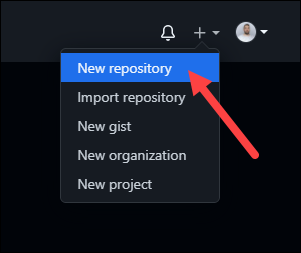
      
    3. Enter a name for your repository, provide a brief description, and choose a privacy setting.
      
    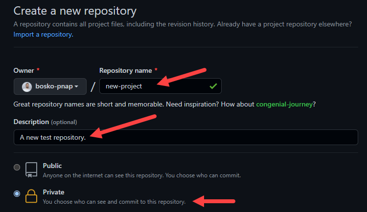
      
    4. Click the Create repository button.

     GitHub allows you to add an existing repo you have <strong>created locally.</strong> To push a local repository from your machine to GitHub, use the following syntax:
     
       git remote add origin https://github.com/[your-username]/[repository-name.git]
       git push -u origin master
    
    For example:
      
    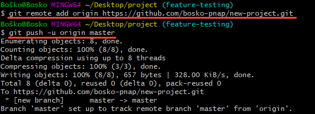
      
    
- ### Add a File to the Repository
    Git notices when you add or modify files in the folder containing the Git repository but doesn't track the file unless instructed. Git saves the changes only for the files it tracks, so you need to let Git know you want to track changes for a specific file.
    
    You can check which files Git is tracking by running:
    
      git status
      
    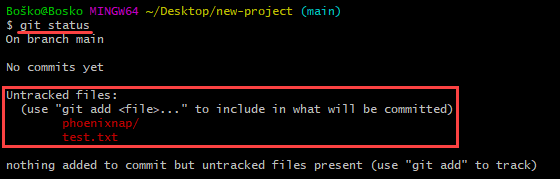
      
    Git notifies you if you have any untracked files. If you want Git to start tracking a file, run the following command:
    
      git add [filename]
      
    For example:
    
    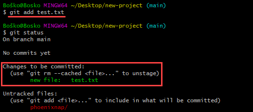
      
    
    In this example, we instructed Git to start tracking changes for the test.txt file. Rerunning the <strong>git status</strong> command shows that Git is tracking the specified file.
    

- ### Unstage Files on Git
    Working with Git usually involves adding all the files to your index to prepare them for a commit. If you want to remove some files from the index before committing, you have to unstage the files in Git.

One way to unstage files on Git is to run the <strong>git reset</strong> command. The syntax is:

      git reset [commit] -- [file_path]
    
    For example:
    
    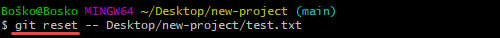
      

- ### Create a Commit
     After adding the specified files to the staging environment, instruct Git to package the files into a commit using the git commit command. Git then stores that file version. You can review the stored version at any given time.

The syntax is:

      git commit -m "Notes about the commit"
      
   Add a message at the end of the commit to state whether it's a new feature, a bug fix, or anything else. Commits remain in the repository, and they are rarely deleted, so an explanation of what you changed helps other developers working on the project or help you keep track of all the changes.

For example:

     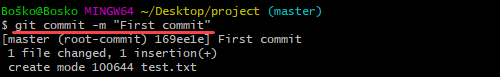
      

- ### Undo Last Commit
     Use the revert and reset commands to undo changes and revert to a previous commit.

To undo a published commit, use the following syntax:

      git revert [hash]
    
A hash is a code that identifies each commit. Obtain a commit hash by running:

      git log
    
For example:

     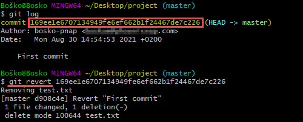
      

In this example, we first ran the <strong>git log</strong> command to obtain the commit hash and then reverted the last commit by running <strong>git revert</strong> with the commit hash we obtained.

- ### Create a New Branch
The first branch in a git repository is called master, and it is the primary branch in a project.

Creating a new Git branch means creating a copy of the project from a specific point in time. Branches in Git allow users to make new features without applying the changes to the main branch while the feature is in development.

The common method for creating a new branch is by running:

      git branch [new_branch_name]

For example:

     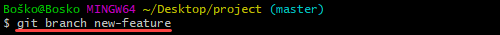
      

In this example, we create a new branch named new-feature.

- ### Switch Branches
Having several branches of a Git project provides a test environment for developers to track progress without affecting the production version of an application. Git allows you to switch between branches with the <strong>checkout</strong> command easily. The syntax is:

      git checkout [branch_name]

Replace [branch_name] with the branch name you want to access.

For example:

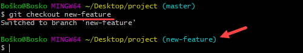
  
    
- ### Rename a Local or Remote Git Branch
In Git, you can rename a local or remote Git branch.

The syntax for changing a local Git branch name is:

      git branch -m new-name

For example:

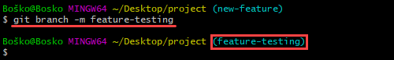

In this example, we changed the local branch name from new-feature to feature-testing.

Since there isn’t a way to directly rename a remote Git branch, you first need to delete the old branch name, then push the new branch name to the remote repository.

- ### Delete a Local or Remote Git Branch
You may decide to delete a Git branch after merging the changes with the master branch or if the branches become corrupted.

You can delete local and remote Git branches.

Deleting a local branch doesn't affect a remote branch. To delete a <strong>local</strong> Git branch, run:

      git branch -d [branch_name]
      
   Use the following syntax to delete a remote Git branch:
   
      git push [remote_project] --delete [branch_name]
      
   In this example, we deleted a local Git branch:
   
   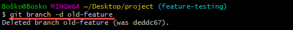

- ### Set Upstream Branch
Sending something upstream in Git means that you are sending it back to the repository owner.

Using the <strong>git set upstream</strong> command, you can choose the flow direction of your current local branch. The command also allows you to change the default remote branch.

   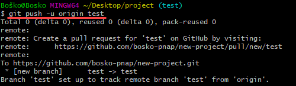

Our tutorial on What Is Git Upstream and How to Set an Upstream Branch deals with the different methods for setting an upstream branch and gives a detailed explanation on the topic.

- ### Remove a Git Remote
A git remote is a connection to a repository hosted on a <strong>remote server</strong> – GitHub, BitBucket, GitLab, or any other remote location.

However, over time, the remote repository may move to another host, or a team member may stop working on the project. The remote in question is then no longer needed.

There are several ways to remove a Git remote. One of the ways is to delete a remote using the command line. The syntax is:

      git remote remove [remote name]
      
In the following example, running <strong>git remote -v</strong> shows the available remotes, 'origin' and 'test-remote.' After removing 'test-remote' and rerunning <strong>git remote -v</strong> to list available remotes, we see that the only available remote is 'origin.'

   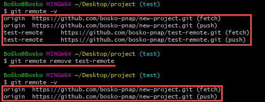

- ### Git Merge
 
Git merge unifies <strong>multiple commit sequences into a single commit.</strong> It can combine two branches, thus integrating the independent development lines into a single branch.

After merging two branches, Git updates the current branch to reflect the merge, but the target branch isn't affected. That means you have to use the <strong>git branch -d</strong> command to delete the obsolete target branch.

For example, you may want to merge a new feature branch into the main branch. Follow the steps below:

1. Run the <strong>git status</strong> command to ensure that HEAD is pointing to the correct merge-receiving (master) branch. If it is not, run <strong>git checkout </strong>master to switch to the master branch.

   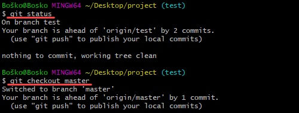
   
2. Run git fetch to pull the latest remote commits and git pull to ensure the main branch has the latest updates.

   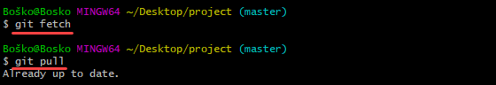
   
3. Run git merge X where X is the name of the branch you want to merge into the receiving branch.

   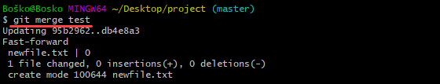

- ### Resolve Merge Conflicts
 Merge conflicts usually occur when multiple developers work on the same code of a project or when they work with several development branches. Git merge warns the user about these conflicts.

Although most merge conflicts resolve automatically, there are cases when git merge cannot resolve an issue.

- ### Create a Pull Request
 Create a pull request (PR) to inform a repository owner that they should review the changes you've made to their code. Then the owner can approve the pull request and merge the changes into the main repository.
 
 If you are the co-owner or owner of a repository, you don't have to create pull requests to merge your changes. However, you can still do it to keep track of your feature updates and history.

For this guide, we will create a readme file for our repository locally and make a pull request on GitHub to illustrate the process.

Follow the steps below:

1. In Git Bash, create an empty readme file by running <strong>touch readme.md.</strong>

2. Create and switch to a new branch on which to modify the file. Run:

      git checkout -b create-readme-file

3. Open the readme file in a text editor and add the text you want it to contain. In this example, we will use the Nano text editor to modify the file within the command line window. Run <strong>nano readme.md<s/trong>.

   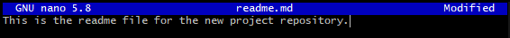

 4. After you save the file, track it by running <strong>git add readme.md<strong>.

5. Create a commit.

      git commit -m "Added a readme file"

6. Push the changes to GitHub.
     
      git push origin create-readme-file
     
 7. Log in to your GitHub page. There is now a <strong>Create pull request</strong> option in your repository with the branch name we created in the command line. Click the <strong>Compare & pull request</strong> button.
   
   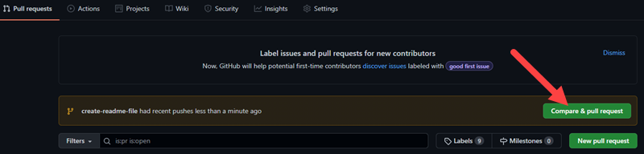
  
8. GitHub states if you can merge the branches and apply the changes. Optionally, add a comment about your pull request and click <strong>Create pull request<strong>. 
     
   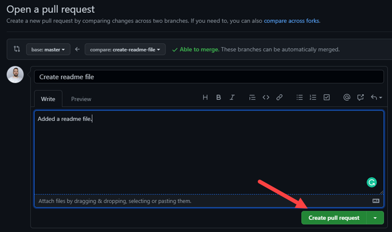
     
   Now the repository owner, in this case, you, can review the changes and accept or reject them.

You can accept the changes in the <strong>Pull requests</strong> tab on GitHub. When you merge the branches, delete the obsolete branch by clicking <strong>Delete branch</strong> to keep the repository clean.
   
- ### Synchronize Changes on GitHub and Locally
  When you merge changes on GitHub, they don't appear automatically in your local repository. You have to pull the changes to your local repository to see the updates.

Synchronize your local repository with GitHub by running:
     
      git pull origin master
     
The command updates your local repository to match the one on GitHub, and states the changes.

In the following example, we first switched to our master branch, and Git warned us that we should update our local repository:     
   
   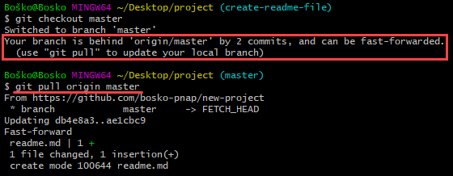
     
 ---
 
# JavaScript
- ### What is javascript?
     JavaScript is a scripting or programming language that allows you to implement complex features on web pages — every time a web page does more than just sit there and display static information for you to look at — displaying timely content updates, interactive maps, animated 2D/3D graphics, scrolling video jukeboxes, etc. — you can bet that JavaScript is probably involved. It is the third layer of the layer cake of standard web technologies, two of which (HTML and CSS) we have covered in much more detail in other parts of the Learning.
     
     <strong>Html</strong> is the markup language that we use to structure and give meaning to our web content, for example defining paragraphs, headings, and data tables, or embedding images and videos in the page.
     
     <strong>CSS</strong> is a language of style rules that we use to apply styling to our HTML content, for example setting background colors and fonts, and laying out our content in multiple columns.
     
     <strong>Javascript</strong> is a scripting language that enables you to create dynamically updating content, control multimedia, animate images, and pretty much everything else. (Okay, not everything, but it is amazing what you can achieve with a few lines of JavaScript code.)

    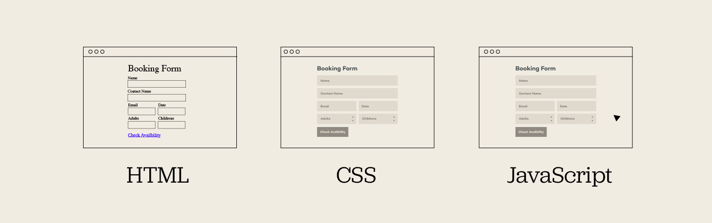
   
    Let's look at some more specific uses of JavaScript in web development
     
     - <strong>Front-End Interactivity:</strong> Web development is only made better by the increased interactivity and features that JavaScript offers.
     - <strong>Web Applications:</strong> Web applications are similar to websites, but instead, they get packaged into a neat little box, which improves control over security and more.
     - <strong>Browser Games:</strong> The modern web browser has come a long way; developers even make robust games that function in a browser.
     - <strong>Back End Web Development:</strong> Web development has come a long way, and now JavaScript is so robust it can even be used to manage the back end of websites and web applications

    Here’s an illustration of all the possible use cases of JS today:
 
    
     
- ### How does JavaScript work?   
     JavaScript is considered a client-side scripting language, which means that it operates on the user's browser and does not function on an external device. An example of a language that is not client-side would be MySQL, a server-side language that handles any database requests.
     
     JavaScript also does not require that anything be downloaded to the user's devices, as modern browsers have the required software integrated into them. This makes JavaScript much more user-friendly than some other languages can be.

  Execution of js –
     1. in browser ( open browser and inspect or console) 
     2. js can be run outside of browser using nodejs
     3. use < script> tag inside any html doc and run that html file

- ### Variables  –      
     
     There are some rules while declaring a JavaScript variable (also known as identifiers).
     1.Name must start with a letter (a to z or A to Z), underscore( _ ), or dollar( $ ) sign.
     2.After first letter we can use digits (0 to 9), for example value1.
     3.JavaScript variables are case sensitive, for example x and X are different variables.

- ### Local variable - 
     A JavaScript local variable is declared inside block or function. It is accessible within the function or block only. 
    
     For example:
     
        

- ### Global variable -      
     A JavaScript global variable is accessible from any function. A variable i.e. declared outside the function or declared with window object is known as global variable. 
     For example:
           
        

- ### VAR     
     Before the advent of ES6, var declarations ruled. There are issues associated with variables declared with var , though. That is why it was necessary for new ways to declare variables to emerge i.e. <strong>let</strong> and <strong>const.</strong>
     
- ### Let
     let is now preferred for variable declaration. It's no surprise as it comes as an improvement to var declarations. It also solves the problem with var that we can’t redeclare  a variable so that to resolve the overriding of variable value if not done knowingly.

     However, if the same variable is defined in different scopes, there will be no error:

      let greeting = "say Hi";
      if (true) {
      let greeting = "say Hello instead";
      console.log(greeting); // "say Hello instead"
      }
      console.log(greeting);//”Say hi”
     
- ### Const     
     Variables declared with the const maintain constant values. const declarations share some similarities with let declarations.   

      const greeting = "say Hi";
      greeting = "say Hello instead";// error: Assignment to constant variable. 

      nor this:
      
      const greeting = "say Hi";
      const greeting = "say Hello instead";// error: Identifier 'greeting' has already been declared

    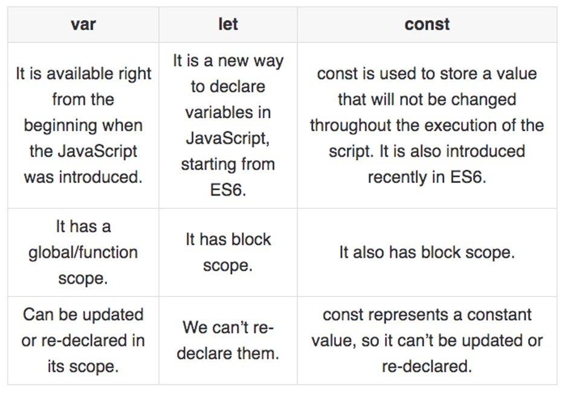
     
- ### Data Types     
     There are eight basic data types in JavaScript. They are:
     
     | Data Types | Description | Example |
     |-----:|---------------|---------------|
     |1.String| represents textual data|'hello', "hello world!" etc|
     |2.Number|an integer or a floating-point number|3, 3.234, 3e-2 etc.|
     |3.Big Int|an integer with arbitrary precision|900719925124740999n , 1n etc.|
     |4.Boolean|Any of two values: true or false|true and false|
     |5.Undefined|a data type whose variable is not initialized|let a;|
     |6.Null|denotes a null value|let a = null;|
     |7.Symbol |data type whose instances are unique and immutable|let value = Symbol('hello');|
     |8.Object|key-value pairs of collection of data|let student = { };|
     
     Here, all data types except Object are primitive data types, whereas Object is non-primitive.
     
     > Note: The Object data type (non-primitive type) can store collections of data, whereas primitive data type can only store a single data.     
     
- ### Template literals (Template strings)     
     Template literals are literals delimited with backtick (`) characters, allowing for multi line strings, string interpolation  with embedded expressions.
     
     Template literals are sometimes informally called template strings, because they are used most commonly , string interpolation  (to create strings by doing substitution of placeholders).
     
 - ### Syntax    
 
      `string text`

      `string text line 1`
      
      `string text line 2`
      
      `let expression = 2;`
      
      `string text ${expression} string text`
     
- ### Operators
     JavaScript operators are symbols that are used to perform operations on operands.
     For example:

     `1.	var sum=10+20;`

     Here, + is the arithmetic operator and = is the assignment operator.
     
     There are following types of operators in JavaScript.

    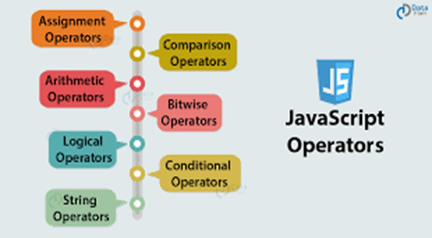

- ### Arithmetic Operators     
     |Operator|Description|Example|
     |-----:|---------------|---------------|
     |  +  |Addition|10+20 = 30|
     |  -  |Subtraction|20-10 = 10|
     |  *  |Multiplication|10*20 = 200|
     |  /  |Division|20/10 = 2|
     |  %  |Modulus (Remainder)|20%10 = 0|
     |  ++  |Increment|var a=10; a++; Now a = 11|
     |  --  |Decrement|var a=10; a--; Now a = 9|

 - ### Comparison Operators    
     
     |Operator|Description|Example|
     |-----:|---------------|---------------|
     |  ==  |Is equal to|10==20 = false|
     |  ===  |Identical (equal and of same type)|10==20 = false|
     |  !=  |Not equal to|10!=20 = true|
     |  !==  |Not Identical|20!==20 = false|
     |  >  |Greater than|20>10 = true|
     |  >=  |Greater than or equal to|20>=10 = true|
     |  < |Less than|20<10 = false|
     |  <= |Less than or equal to|20<=10 = false|

- ### Bitwise Operators

     |Operator|Description|Example|
     |-----:|---------------|---------------|
     |  &  |Bitwise AND|(10==20 & 20==33) = false|
     |  |  |Bitwise OR|(10==20 | 20==33) = false|
     |  ^  |Bitwise XOR|(10==20 ^ 20==33) = false|
     |  ~  |Bitwise NOT|(~10) = -10|
     |  << |Bitwise Left Shift|(10<<2) = 40|
     |  >> |Bitwise Right Shift|(10>>2) = 2|
     |  >>> |Bitwise Right Shift with Zero|(10>>>2) = 2|
    
- ### Logical Operators

     |Operator|Description|Example|
     |-----:|---------------|---------------|
     |  &&  |Logical AND|(10==20 && 20==33) = false|
     |  ||  |Logical OR|(10==20 || 20==33) = false|
     |  !  |Logical Not|!(10==20) = true|

- ### Assignment Operators

     |Operator|Description|Example|
     |-----:|---------------|---------------|
     |  =  |Assign|10+10 = 20|
     |  +=  |Add and assign|var a=10; a+=20; Now a = 30|
     |  -=  |Subtract and assign|var a=20; a-=10; Now a = 10|
     |  *=  |Multiply and assign|var a=10; a*=20; Now a = 200|
     |  /=  |Divide and assign|var a=10; a/=2; Now a = 5|
     |  %=  |Modulus and assign|var a=10; a%=2; Now a = 0|
   
- ### Special Operators

     |Operator|Description|
     |-----:|---------------|
     |(?:)|Conditional Operator returns value based on the condition. It is like if-else.|
     |  ,  |Comma Operator allows multiple expressions to be evaluated as single statement.|
     |  delete  |Delete Operator deletes a property from the object.|
     |  In  |In Operator checks if object has the given property|
     |  Instanceof  |checks if the object is an instance of given type|
     |  New  |creates an instance (object)|
     |  Typeof  |checks the type of object.|
     |  Void  |it discards the expression's return value.|
     |  Yield  |checks what is returned in a generator by the generator's iterator.|

- ### String
     The <strong>JavaScript string</strong> is an object that represents a sequence of characters.
     |Methods|Description|
     |-----:|---------------|
     |charAt()| It provides the char value present at the specified index.|
     |charCodeAt()|It provides the Unicode value of a character present at the specified index.|
     |concat()|It provides a combination of two or more strings.|
     |indexOf()|It provides the position of a char value present in the given string.|
     |lastIndexOf()|It provides the position of a char value present in the given string by searching a character from the last position.|
     |search()|It searches a specified regular expression in a given string and returns its position if a match occurs.|
     |match()|It searches a specified regular expression in a given string and returns that regular expression if a match occurs.|
     |replace()|It replaces a given string with the specified replacement.|
     |substr()|It is used to fetch the part of the given string on the basis of the specified starting position and length.|
     |substring()|It is used to fetch the part of the given string on the basis of the specified index.|
     |slice()|It is used to fetch the part of the given string. It allows us to assign positive as well negative index.|
     |toLowerCase()|It converts the given string into lowercase letter.|
     |toLocaleLowerCase()|It converts the given string into lowercase letter on the basis of host?s current locale.|
     |toUpperCase()|It converts the given string into uppercase letter.|
     |toLocaleUpperCase()|It converts the given string into uppercase letter on the basis of host?s current locale.|
     |toString()|It provides a string representing the particular object.|
     |valueOf()|It provides the primitive value of string object.|
     |split()|It splits a string into substring array, then returns that newly created array.|
     |trim()|It trims the white space from the left and right side of the string.|

- ### Conditional Statements

     - if Statement
     
      if (condition) {
      //  block of code to be executed if the condition is true
      }

     - if else Statement
     
      if (condition) {
      //  block of code to be executed if the condition is true
      } else {
      //  block of code to be executed if the condition is false
      }

     - else if Statement 
    
      if (condition1) {
      //  block of code to be executed if condition1 is true
      } else if (condition2) {
      //  block of code to be executed if the condition1 is false and condition2 is true
      } else {
      //  block of code to be executed if the condition1 is false and condition2 is false
      }

     - Switch Statement
     
      switch(expression) {
      case x:
      // code block
      break;
      case y:
      // code block
      break;
      default:
      // code block
      }

- ### Loops
     The JavaScript loops are used to iterate the piece of code using for, while, do while or for-in loops. It makes the code compact. It is mostly used in array.
     
     There are four types of loops in JavaScript.
     1.for loop
     2.while loop
     3.do-while loop
     4.for-in loop

    - For loop
     The  `for loop` iterates the elements for the fixed number of times. It should be used if number of iteration is known. The syntax of for loop is given below.
     
     |    |    |
     |-----:|---------------|
     |for (initialization; condition; increment) { code to be executed }||

    - while loop
    
    `while loop` iterates the elements for the infinite number of times. It should be used if number of iteration is not known. The syntax of while loop is given below.
    
     |    |    |
     |-----:|---------------|
     |while (condition) { code to be executed }||

     - do while loop

     `do while loop` iterates the elements for the infinite number of times like while loop. But, code is executed at least once whether condition is true or false. The syntax of do while loop is given below.

      do
      {  
      code to be executed  
      } while (condition);  
-

        

     - for...in loop
     In each iteration of the loop, a key is assigned to the key variable. The loop continues for all object properties.
     
      for (key in object) {
      // body of for...in
      }
-

      const student = {
      name: 'Monica',
      class: 7,
      age: 12
      }
      // using for...in
      for ( let key in student ) {
      // display the properties
      console.log(`${key} => ${student[key]}`);
      }

- ### Functions
     `Functions` are used to perform operations. We can call JavaScript function many times to reuse the code.

     - With Arguments
     
        
      <form>  
      <input type="button" value="click" onclick="getcube(4)"/>  
      </form> 

     - Return value
     
       

     - Function Object

        

- ### Let's see function methods with description.

     |Method|Description|
     |-----:|---------------|
     |apply()|It is used to call a function contains this value and a single array of arguments.|
     |bind()|It is used to create a new function.|
     |call()|It is used to call a function contains this value and an argument list.|
     |toString()|It returns the result in a form of a string.|

- ### Arrow Functions
     - Arrow functions were introduced in ES6.
     
     Syntax before arrow
     
      hello = function() {
      return "Hello World!";
      }

     Syntax after arrow

      hello = () => {
      return "Hello World!";
      }

- ### Objects
     A javaScript object is an entity having state and behavior (properties and method). For example: car, pen, bike, chair, glass, keyboard, monitor etc
     
     JavaScript is an object-based language. Everything is an object in JavaScript.
JavaScript is template based not class based. Here, we don't create class to get the object. But, we direct create objects

     There are 3 ways to create objects.

     - JavaScript Object by object literal

     Syntax
     
__

      object={
      property1:value1,
      property2:value2
      }  
__

        

__

     - By creating instance of Object
__

     Syntax
     
      var objectname=new Object();  
__

        
__

     - By using an Object constructor
__

        

- ### Arrays
     An array is a special variable, which can hold more than one value.

     - Why to use Arrays
     If you have a list of items (a list of car names, for example), storing the cars in single variables could look like this:

      let car1 = "Saab";
      let car2 = "Volvo";
      let car3 = "BMW";

     However, what if you want to loop through the cars and find a specific one? And what if you had not 3 cars, but 300?
     
     The solution is an array!
     
     An array can hold many values under a single name, and you can access the values by referring to an index number.

     - Creating an Array

      const array_name = [item1, item2, ...]; 
__

      const cars= ["Saab", "Volvo", "BMW"];
      Spaces and line breaks are not important. A declaration can span multiple lines:
      const cars = ["Saab","Volvo","BMW"];

- ### Arrays are Objects
     Arrays are a special type of objects. The typeof operator in JavaScript returns "object" for arrays.
     
     But, JavaScript arrays are best described as arrays.
     
     Arrays use numbers to access its "elements". In this example, person[0] returns John:
     
     Array : `const person = ["John", "Doe", 46];`
     
     Objects use names to access its "members". In this example, person.firstName returns John:
     
     Objects : `const person = {firstName:"John", lastName:"Doe", age:46};`

- ### Promises
     The Promise object represents the eventual completion (or failure) of an asynchronous operation and its resulting value.
     A Promise is in one of these states:
     - pending: initial state, neither fulfilled nor rejected.
     - fulfilled: meaning that the operation was completed successfully.
     - rejected: meaning that the operation failed.

   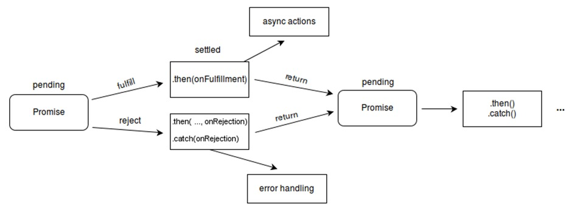

     - A promise can be created using Promise constructor

     Syntax : 

      var promisename = new Promise (function(resolve,reject){
      //do something
      })
      
     Example :
     
      var promise = new Promise(function(resolve, reject) {
      const x = "geeksforgeeks";
      const y = "geeksforgeeks"
      if(x === y) {
      resolve();
      } else {
      reject();
      }
      });
   
      promise.
      then(function () {
      console.log('Success, You are a GEEK');
      }).
      catch(function () {
      console.log('Some error has occurred');
      });

     - When a promise is fulfilled
     When a promise is fulfilled, you can access the resolved data in the then method of the promise:

      promise.then(value => {
      // use value for something
      })

     Think of the then method as "this works and then do this with the data returned from the promise". If there is no data, you can skip the then method.
     It's also possible that the then method can return another promise, so you can chain another then method like this:

      Promise
      .then(value => {
      return value.anotherPromise()
      })
      .then(anotherValue => {
      // use this value
      })

     - When a promise is rejected
     When a promise is rejected (that is, the promise fails), you can access the error information returned in the catch method of the promise:

      promise.catch(error => {
      // interpret error and maybe display something on the UI
      })

     - When a promise settles
     There's a last stage of the promise. Whether the promise is fulfilled or is rejected, the promise has been completed (has been settled). At this completed stage, you can finally do something.
     
     example
     
      let dataIsLoading = true;

      promise
      .then(data => {
      // do something with data
      })
      .catch(error => {
      // do something with error
      })
      .finally(() => {
      dataIsLoading = false;
      })

- ### Async Syntax
     The keyword async before a function makes the function return a promise:

      async function myFunction() {
      return "Hello";
      }
      is same as :
      function myFunction() {
      return Promise.resolve("Hello");
      }

- ### Await Syntax

     The await keyword can only be used inside an async function.

      async function myDisplay(){
      let myPromise= new Promise(function(resolve,reject){
      resolve("resolved!");
      });
      document.getElementById("demo").innerHTML = await myPromise;
      }

      myDisplay();

     The two arguments (resolve and reject) are pre-defined by JavaScript.
     We will not create them, but call one of them when the executor function is ready.

- ### Browser Object Model (BOM)

     The Browser Object Model (BOM) is used to interact with the browser.

     example

      window.alert("hello javatpoint");  

      is same as: 

      alert("hello javatpoint");  

- ### Document Object Model
     The document object represents the whole html document.
     When html document is loaded in the browser, it becomes a document object. It is the root element that represents the html document. It has properties and methods. 

      window.document  
      is same as :
      document  

- ### The important methods of document object are as follows:

     |Method|Description|
     |-----:|---------------|
     |write("string")|writes the given string on the doucment.|
     |writeln("string")|writes the given string on the doucment with newline character at the end.|
     |getElementById()|returns the element having the given id value.|
     |getElementsByName()|returns all the elements having the given name value.|
     |getElementsByTagName()|returns all the elements having the given tag name.|
     |getElementsByClassName()|returns all the elements having the given class name.|

- ### Classes
     ECMAScript 2015, also known as ES6, introduced JavaScript Classes.
     JavaScript Classes are templates for JavaScript Objects.

     - Use the keyword class to create a class.
     - Always add a method named `constructor():`
     
      class ClassName{
      constructor(){ 
      ... }
      }

     - The example below creates a class named "Car".
     - The class has two initial properties: "name" and "year".

      class Car{
      constructor(name, year) {
      this.name =name;
      this.year =year;
      }
      }

     A JavaScript class is not an object.
     It is a template for JavaScript objects.

     When you have a class, you can use the class to create objects:

      let myCar1= new Car("Ford", 2014);
      let myCar2 = new Car("Audi", 2019);
      The example above uses the Car class to create two Car objects.
      The constructor method is called automatically when a new object is created.

   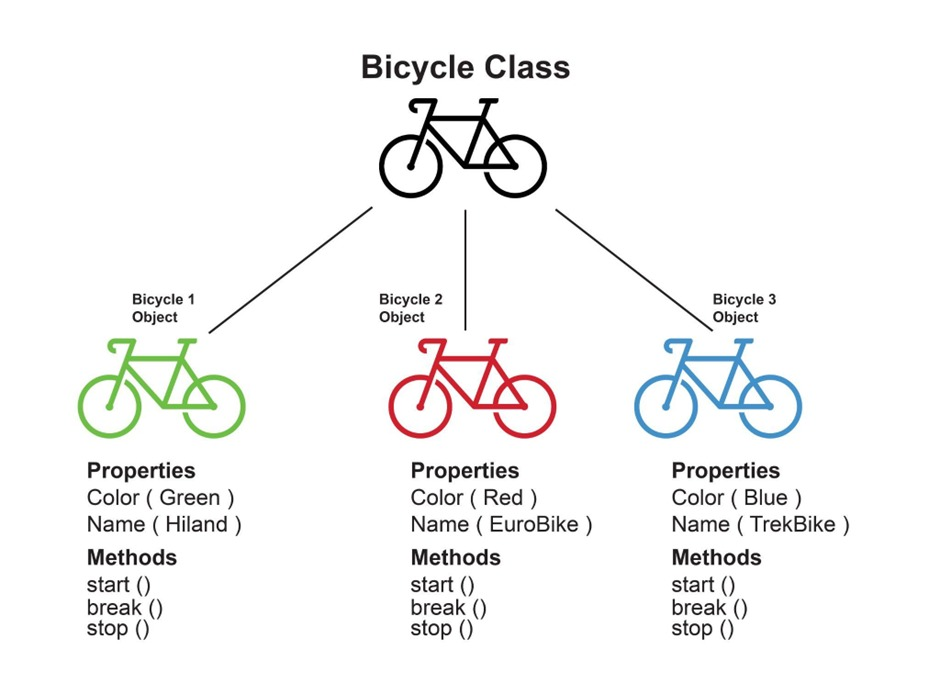

- ### Exception Handling 
     In programming, exception handling is a process or method used for handling the abnormal statements in the code and executing them. It also enables to handle the flow control of the code/program. 

     `try{} statement`: Here, the code which needs possible error testing is kept within the try block. In case any error occur, it passes to the catch{} block for taking suitable actions and handle the error. Otherwise, it executes the code written within.

     `catch{} statement`: This block handles the error of the code by executing the set of statements written within the block. This block contains either the user-defined exception handler or the built-in handler. This block executes only when any error-prone code needs to be handled in the try block. Otherwise, the catch block is skipped

      try{  
      expression; //code to be written.  
      } catch(error){  
      expression;
      } // code for handling the error.  

__

      try{  
      var a= ["34","32","5","31","24","44","67"]; //a is an array  
      document.write(a);    // displays elements of a  
      document.write(b); //b is undefined but still trying to fetch its value. Thus catch block       will be invoked  
      }catch(e)
      {  
      alert("There is error which shows "+e.message); //Handling error  
      }  

__   
           
Throw statements are used for throwing user-defined errors. User can define and throw their own custom errors.
-
           throw exception;  
__

      try {  
      throw new Error('This is the throw keyword'); //user-defined throw statement.  
      }  catch (e) {  
      document.write(e.message); // This will generate an error message  
      }  

- ### try…catch…finally statements
     Finally is an optional block of statements which is executed after the execution of try and catch statements.

      try{  
      expression;  
      }  catch(error){  
      expression;  
      }  finally{  
      expression;
      } //Executable code  

__

      try{  
      var a=2;  
      if(a==2)  
      document.write("ok");  
      }  catch(Error){  
      document.write("Error found"+e.message);  
      }  finally{  
      document.write("Value of a is 2 ");  
      } 

- ### Use Strict (Strict Mode )
`"use strict"`; Defines that JavaScript code should be executed in "strict mode".

Strict mode is declared by adding `"use strict"`; to the beginning of a script or a function.

      “use strict”;
      myFunction();

      function myFunction() {
      y = 3.14;   // This will also cause an error because y is not declared
      }

__

      x = 3.14;       //  This will not causeerror.
      myFunction();

      function myFunction() {
      “use strict”;
      y = 3.14;   // This will cause an error
      }
     
 ---
 
 # HTML
- ### What Is HTML ?
     HTML stands for hypertext markup language – it is used to display web pages on the browser. In order to create web pages.
- ### HTML Tags
     One of the main parts of HTML is HTML tags – HTML tags are like keywords that define how a web browser will format and display content.
     
     <strong>< !DOCTYPE html ></string> is a tag used to tell the browser the version of html that you are using.
     
   HTML tags contain three main parts:
     - opening tag
     - content
     - closing tag
     
   Opening tag
     - Begins the section of a page
     - All opening tags are enclosed in <>
     
   Content
     - The matter written in between the opening and closing tags.
     - <> content </>.
     
   Closing tag
     - It ends the section of a page.
     - All closing tags are enclosed with, </>.
     
   Most HTML tags are paired tags, very few tags are unpaired. 

- ### Paired tags
   <strong>Paired tags</strong> have both opening and closing tags.
          
   Example:
          
          <html>  </html>
          
 

          <b> </b>

- ### Unpaired tags  
          
     <strong>Unpaired tags</strong> have no ending or closing tags.
          
      Example:
          
           
          

          
 
- ### HTML Basic ElementsHTML tags case sensitive ?

     All the HTML elements/tags are case-insensitive. Case-insensitive means the tags/elements which are used in the code are understandable by the browser irrespective of the letters being the upper case or lower case classes.
          
      Example:
          
          <!DOCTYPE html>
          <html>
          <body>
               <h2>Welcome To AD</h2>
               
AppsDeployer

               
The code has lowercase body tags

          </body>
          </html>

- ### HTML Basic Elements
          
     The basic elements of an HTML page are: 
          
     A text header, denoted using the <strong>< h1>, < h2>, < h3>, < h4>, < h5>, < h6> tags.</strong>
          
     A paragraph, denoted using the <strong>< p></strong> tag.
          
     A horizontal ruler, denoted using the <strong>< hr></strong> tag.
          
     A link, denoted using the <strong>< a></strong> (anchor) tag.
          
     A list, denoted using the <strong>< ul></strong> (unordered list), <strong>< ol></strong> (ordered list) and <strong>< li></strong> (list element) tags.
          
     An image, denoted using the <strong>< img></strong> tag.
          
     A divider, denoted using the <strong>< div></strong> tag.
          
     A text span, denoted using the <strong>< span></strong> tag.
         
 - ### Lists
     HTML provides a way to create both an 
1. <strong>ordered list</strong> (with elements counting up, 1, 2, 3...) and an 
2. <strong>unordered list</strong> with bullets instead of numbers.

 - ### Images
     To add an image, use the <strong>< img></strong> tag along with the <strong>src</strong> attribute to specify the location of the image.
          
     Example:  
          
       
   
- ### Comment in html     
     The comment tag is used to insert comments in the source code. Comments are not displayed in the browsers.
          
       <!--This is a comment. Comments are not displayed in the browser-->
     
- ### HTML Attributes
     HTML attributes are the special words placed inside the opening tags and used to define the characteristics of an HTML element. 
          
     The four core attributes that can be used on the majority of HTML elements
          
     <strong>Id =><strong> The id attribute of an HTML tag can be used to uniquely identify any element within an HTML page.
           
     <strong>Title =><strong> The title attribute gives a suggested title for the element.
           
     <strong>Class =><strong> The class attribute is used to associate an element with a style sheet, and specifies the class of element. 
           
     <strong>Style =><strong> The style attribute allows you to specify Cascading Style Sheet (CSS) rules within the element.
   
- ### HTML Table     
     HTML table tag is used to display data in tabular form (row * column). There can be many columns in a row. 
     - #### HTML Table Tags 
       < table>=> It defines a table.
            
       < tr>=> It defines a row in a table.
            
       < th>=> It defines a header cell in a table.
            
       < td>=> It defines a cell in a table.
            
       < caption>=> It defines the table caption.
            
       < colgroup>=> It specifies a group of one or more columns in a table for formatting.
            
       < col>=> It is used with <colgroup> element to specify column properties for each column.
            
       < tbody>=> It is used to group the body content in a table.
            
       < thead>	 => It is used to group the header content in a table.
            
       < tfooter>	=> It is used to group the footer content in a table.

- ### HTML Form
     An HTML form is a section of a document which contains controls such as text fields, password fields, checkboxes, radio buttons, submit button, menus etc.
            
     <strong>Why use HTML Form</strong>
            
     HTML forms are required if you want to collect some data from of the site visitor.
     HTML Form Syntax
            
       < form action="server url" method="get|post">  
       //input controls e.g. textfield, textarea, radiobutton, button  
       < /form>  

- ### HTML Form Tags
     < form>         =>     It defines an HTML form to enter inputs by the used side.
          
     < input>        =>     It defines an input control.
          
     < textarea>     =>     It defines a multi-line input control.
          
     < label>        =>     It defines a label for an input element.
          
     < fieldset>     =>   It groups the related element in a form.
          
     < legend>       =>   It defines a caption for a < fieldset> element.
          
     < select>       =>   It defines a drop-down list.
          
     < optgroup>	 =>  It defines a group of related options in a drop-down list.
          
     < option>	      =>  It defines an option in a drop-down list.
          
     < button>	      =>  It defines a clickable button.
 
- ### Page Layout Techniques
     using Semantic tags for layout using the Right Tags 

       <header>
       <main>
       <footer> 

     Inside Main Tag 

     Section Tag   -> For a section on your page

       <section>

     Article Tag  -> For an article on your page

       <article> 

     Aside Tag  -> For content aside main content(ads)

       <aside>

-### Div Tag

     Div is a container used for other HTML elements 
     Block Element (takes full width) 

# CSS   
          
---
